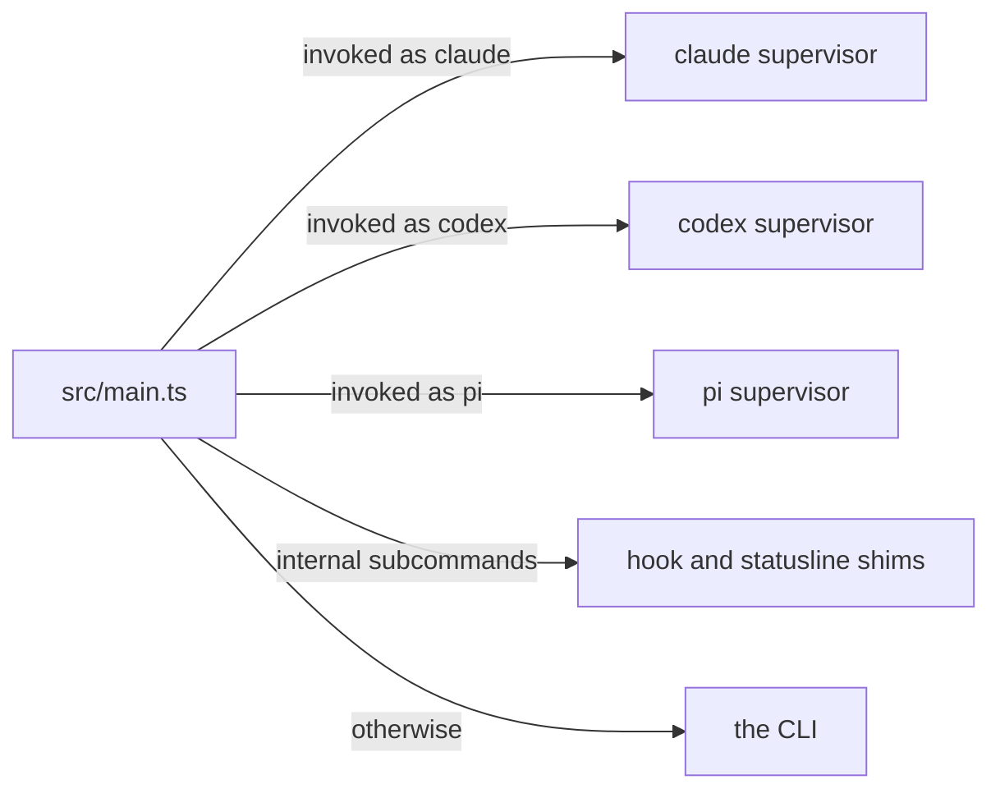
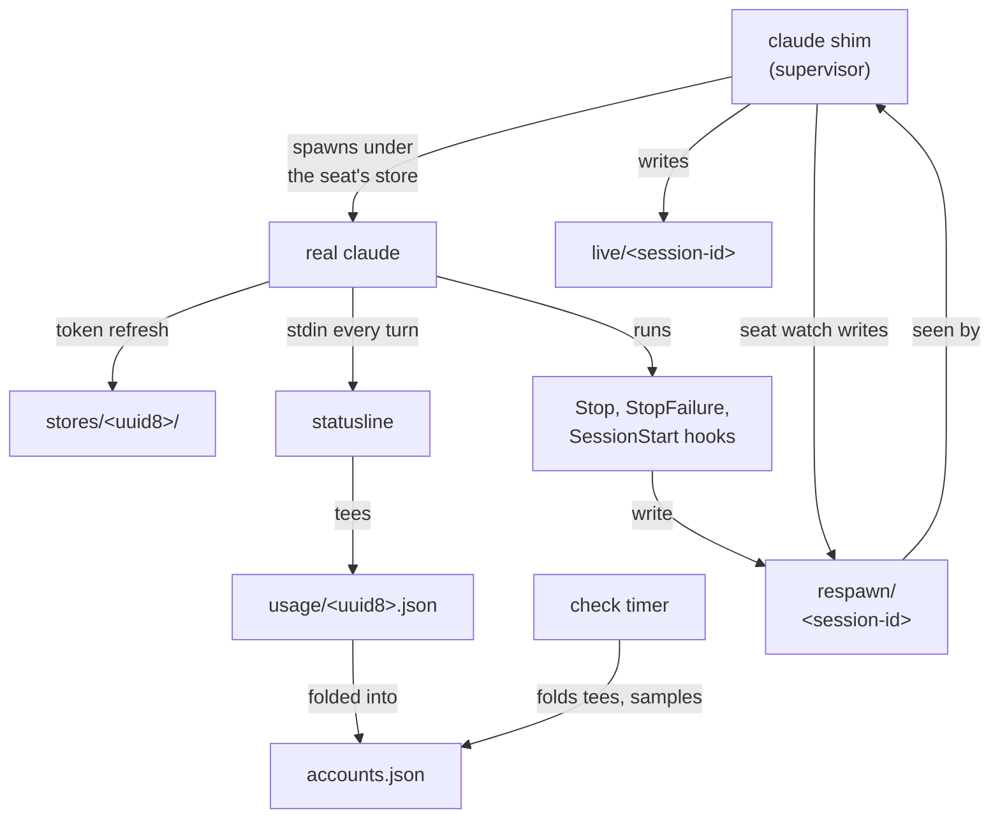
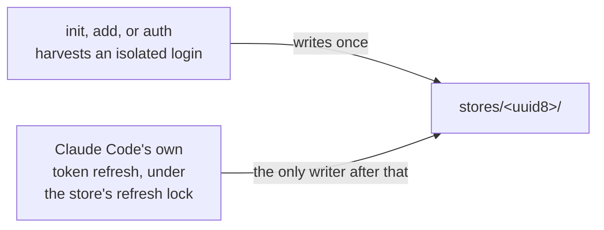
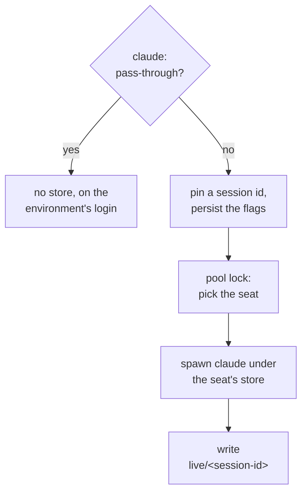
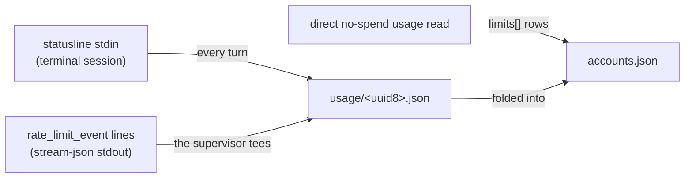
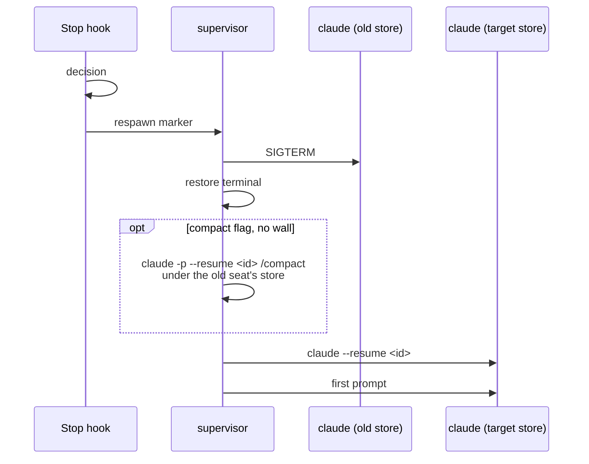
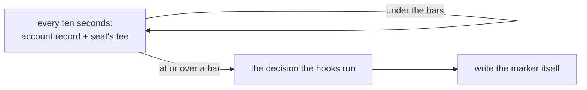
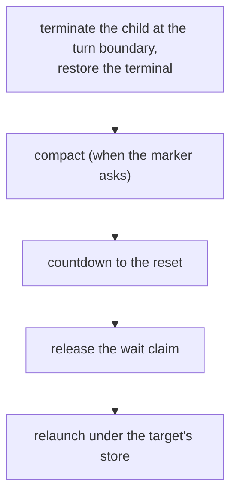
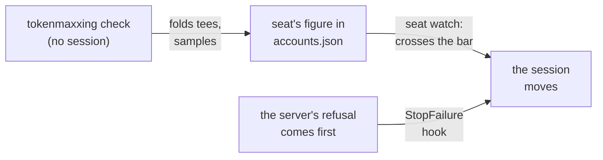
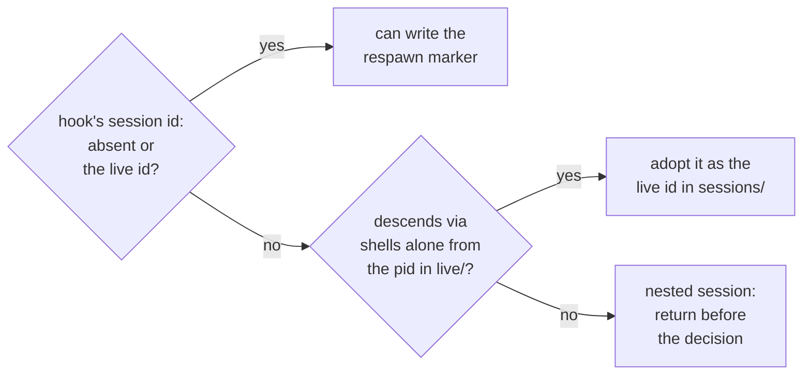

tokenmaxxing is one multi-call entry point (`src/main.ts`). It runs directly under Bun; the npm package ships TypeScript source, not a build.

For the Claude pool, the pieces and the state files they share fit together as follows. The sections below describe each one.

## Providers

One switching engine serves both switching pools. The account model, the picker, the decision, and the account commands take a provider (`src/lib/provider.ts`). The provider's `seats` capability names the difference between the two pools.

| Provider | Module | `seats` | What the provider wires |
| --- | --- | --- | --- |
| Claude | `src/lib/claude.ts` | `shared`: several sessions can run on one account's store, and a session moves only by respawn | the per-account credential stores, session presence, the OAuth profile endpoint, the statusline tee, and the no-spend usage GET |
| Codex (see [Codex support](/codex)) | `src/lib/codex.ts` | `live`: at most one session runs on an account, because codex has no cross-process refresh lock, and an account running in another session is never a target | its per-account stores (`codex-stores/<uuid8>/` with `auth.json`, everything else symlinked to the shared `~/.codex`), its identity, the usage GET and the refresh it needs, presence, and the store check before a move |

- **pi** is a client of both switching pools rather than a pool of its own. The pi supervisor (`src/entries/pisupervisor.ts`) runs a pi session on a Claude or Codex account through that account's pi store. It drives the same decision through the pool's provider with one change: the store check before a move reads the target's pi store (`src/lib/pi.ts`; see [pi support](/pi)).
- **grok** (`src/lib/grok.ts`) is a `statusOnly` provider: it gets the same stores and account commands and no supervisor, hooks, or switching. grok `status` reads the weekly subscription credit window (see [Status-only pools](/status-only-pools)).

Everything below describes the Claude provider unless it says otherwise.

## One credential store per account

Each pooled account owns one Claude Code credential store under the state directory: `stores/<uuid8>/`.

| Platform | Where the credential lives |
| --- | --- |
| Linux | the `.credentials.json` file inside the store |
| macOS | the keychain item that Claude Code keys by the store path (`Claude Code-credentials-<sha256(path)[0:8]>`) |

A session runs on an account because the supervisor sets `CLAUDE_SECURESTORAGE_CONFIG_DIR` to that account's store before it spawns claude. Only the credential is namespaced: `~/.claude` (settings, transcripts, plugins) and `~/.claude.json` stay shared, so `--resume` works across stores.

After that first write, the only writer is Claude Code's own token refresh, which runs inside each session under the refresh lock rooted at the store, so sessions that share an account coordinate the way two windows of one login always did. A credential is never copied between stores: a refresh rotation revokes the previous access token of that grant, so two stores holding one grant would break each other.

## The supervisor shim

`init` writes a 2-line shell shim named `claude` into `~/.config/tokenmaxxing/bin/`, beside the `tokenmaxxing` and `xx` entry points, and puts that directory ahead of the real binary on PATH. When you type `claude`, the shim runs the supervisor, which picks an account, spawns the real claude binary, and records the session's presence. The supervisor is a process and terminal manager only: it never proxies API traffic and never touches tokens.

### Launching a session

For an interactive session, the supervisor:

1. Pins a session id: it generates one, or reuses the one you passed via `--session-id`, `-r <id>`, or `-c`.
2. Persists your launch flags, so a later relaunch can replay them.
3. Takes the pool lock and picks the seat (see [How switching decides](/switching)).
4. Spawns claude with `CLAUDE_SECURESTORAGE_CONFIG_DIR` set to that account's store, with inherited stdio (stdin through a relay pipe when the session runs with `--input-format stream-json`) and a saved `stty -g` terminal snapshot.
5. Writes `live/<session-id>` with the account id, the child's pid, and its start time.

The lock covers the pick and the presence write, so two launches at once see each other and land on different accounts. The presence file is validated against the process start time whenever it is read, so a dead session never counts.

| Pool at launch | Where the session starts |
| --- | --- |
| Every account at or over a bar | the account whose block clears soonest |
| No pooled account, or every account needs re-auth | no store, on whatever login the environment names, still under the supervisor's marker watch |

### What passes straight through

These invocations pass straight through with no store and no session management. They use whatever login the environment already names, by default Claude Code's own store.

- Print-mode invocations: `claude -p`, `--version`, `--help`.
- Every subcommand: `claude mcp`, `claude plugins list`, `claude auth`, `claude attach`, and so on.
- The interactive resume picker: `claude -r` with no session id.
- An invalid `--session-id`.
- `--fork-session` with a resume.
- A run with `--no-session-persistence`: Claude Code saves no transcript for it, so a move could not resume it. T3 Code's provider capability probe is one.
- tokenmaxxing's own probes.

### Signals and environment files

When the supervisor itself receives SIGTERM, it forwards the signal to the real claude process and exits after it, so a harness stop or restart never leaves an orphaned session running on the old seat. The Claude Agent SDK stops a session that way, and harnesses such as T3 Code drive claude through the SDK.

The `tokenmaxxing` entry point starts Bun with `--no-env-file`, so the supervisor does not import `.env` files from the working directory, and the session it spawns does not inherit their values from it. This covers every path that runs through that entry point: the `claude`, `codex`, and `pi` shims, the hooks, the statusline, and the check timer. The claude binary is a Bun executable that reads those files on its own, which the shim cannot change.

## The statusline tee

### Terminal sessions

Claude Code pushes rate-limit data (`rate_limits.five_hour` and `rate_limits.seven_day`) into the statusline's stdin every turn. tokenmaxxing owns the statusline slot, so its renderer doubles as a free, push-based usage feed. Each tick it tees the aggregate windows plus the active model into `usage/<uuid8>.json` for the account whose store the session runs under (read from the inherited `CLAUDE_SECURESTORAGE_CONFIG_DIR`). A session with no pooled store writes no tee.

### Per-model caps

Per-model caps are not in statusline stdin. They come from a sample: the direct no-spend usage read and its `limits[]` rows. The rows are stored on the account record in `accounts.json` next to the aggregate windows, so the tee never carries them.

- An expired stored access token gets no read: the sample first has Claude Code refresh it under that store (see [Periodic check](/switching#periodic-check)).
- Inside a hook decision, the seat is sampled once when its tee is older than `policy.usagePollTtlMs` or when the session's model is a gated family, at most once per sample interval (see [Periodic check](/switching#periodic-check)), so a Fable session keeps its Fable cap fresh.
- The interval doubles after each failed sample, up to 30 minutes, and resets on success.

### Stream-json sessions

A stream-json session (the Agent SDK, T3 Code) runs no statusline. Its supervisor pipes the child's stdout instead, forwards every byte unchanged, and writes the same tee from each `rate_limit_event` line.

- `rate_limit_info.unifiedWindows` carries the session and weekly windows that Claude Code reads from the response headers of every model request.
- Claude Code writes the line whenever either window moves by a point.
- Each `assistant` line restamps the tee, because a response that wrote no event moved nothing.

### When the tee is written

The tee is written on change.

| Push | Effect on the tee file |
| --- | --- |
| Changed | the file is rewritten |
| Unchanged, within 30 seconds of the last write | only the file's mtime is bumped, which acts as the feed's liveness heartbeat |
| Unchanged, later | the file is rewritten with a fresh sample time |

Freshness is judged by mtime; ordering against the stored record is judged by the sample time inside the file.

## The Stop hook and the move

### The decision

At every turn boundary, the Stop hook runs the switch decision for its own seat, the account whose store the session runs under (see [How switching decides](/switching)). When a move is warranted, the decision runs under a `flock(2)` exclusive lock (taken via `bun:ffi`, since macOS ships no `flock(1)` binary). Under that lock it:

1. Folds every account's tee into `accounts.json`.
2. Ranks the usable accounts.
3. Verifies that the target's store holds a usable credential.
4. Returns the target.

### The respawn marker

The hook then writes `respawn/<session-id>`.

| Field | Meaning |
| --- | --- |
| Target account | the account the session moves to |
| Session to resume | the process's live session id |
| `waitUntil` | the timestamp of a depleted-pool wait (see [Depleted-pool wait and auto-resume](#depleted-pool-wait-and-auto-resume)) |
| Compact flag | asks the supervisor to compact; set by the Stop and SessionStart hooks and the seat watch, cleared by StopFailure |
| Origin | the writer: the Stop, SessionStart, or StopFailure hook, or the supervisor's seat watch |
| Launch time | the launch time of the process the marker was written for, so a marker left by an earlier launch of the same session is discarded |

- The marker file is named after the session id the supervisor launched with. The session to resume inside it is the process's live session id, which differs after a `/clear`.
- The Stop, StopFailure, and SessionStart hooks write that marker only when stdin `session_id` is absent or names that live session (see [The SessionStart hook](#the-sessionstart-hook)), so a nested process that inherits the supervised environment and runs its own session does not move the parent.

### The respawn

The supervisor sees the marker and:

1. SIGTERMs its child at the already-committed turn boundary. The Stop hook runs after the transcript is on disk and claude is idle, so nothing is lost.
2. Restores the terminal.
3. Compacts the conversation when the marker asks for it and the old seat carries no enforced-limit wall: `claude -p --resume <live-session-id> /compact` under the old seat's store, bounded at 5 minutes. The compaction counts only when Claude Code writes its compaction boundary into the transcript. A failure prints why, and the move goes on with the full context.
4. Relaunches `claude --resume <live-session-id>` with `CLAUDE_SECURESTORAGE_CONFIG_DIR` set to the target's store. The resumed process reads the target's store cold and continues the same conversation on the new account.

The move writes no credential. Other sessions are not affected: each session moves on its own seat's figures.

### The first prompt

The relaunch also submits a first prompt that says the session was resumed on an account with headroom (and compacted, when it was), so the conversation goes on without a keystroke. The restart ends every background Bash task, Monitor, and Workflow run the session started, and the prompt depends on the marker's origin.

| Origin | The first prompt asks Claude to |
| --- | --- |
| Stop hook (the previous turn had finished) | end the turn without restating it, unless that turn waited on background work, which Claude relaunches |
| SessionStart hook, StopFailure hook, or seat watch | continue the task, or restate what it needs when the previous turn ended waiting on you, and relaunch the background work the task still needs |

A SessionStart move is in the second group because a prompt sent inside the marker poll window can already have started on the old seat (see [The SessionStart hook](#the-sessionstart-hook)).

### Terminal and harness sessions

| Session | The first prompt | The supervisor's notices |
| --- | --- | --- |
| Terminal | the positional argument after the session id | stderr |
| Harness that drives claude with `--input-format stream-json` | the first `user` line of each relaunched process | stdout, as `system` lines of subtype `informational` and level `warning` |

A harness session that drives claude with `--input-format stream-json` ignores a positional prompt, so there the supervisor owns stdin and relays the harness's JSON lines to the child through a pipe. It sends each relaunched process the latest setup requests the harness sent (`initialize`, which carries the harness's appended system prompt, hooks, and in-process MCP servers, and the requests that set the model, the permission mode, and the thinking budget), and then writes the prompt as its first `user` line. The supervisor's notices are the compaction, the move, the depleted-pool wait with its resume time, the resume, and a fatal that ends the session. The stdout line is the shape Claude Code uses for its own print-mode notices, so a harness such as T3 Code shows them in the conversation and the stream stays parseable. Before those notices, the supervisor closes the tasks the move ended: for each task the old process started on that stdout (`task_started`) and did not end there (a `task_notification`, or a `task_updated` to `completed`, `failed`, or `killed`), it writes a `task_notification` line with `status: "stopped"` and `reason: "worker_restart"`, the line Claude Code writes when a restarted process finds a task orphaned, so a harness that tracks background work from the stream stops showing it as running.

### A session with no transcript

A session whose transcript file is missing (a `/clear` with no turn since, or a move before the first turn) gets neither the compaction nor the prompt. It is started with `--session-id` instead of `--resume`, because `claude --resume` exits with `No conversation found` for an id that has no transcript.

In a stream-json session the supervisor then replays to the new process the harness's messages and setup requests (`initialize` and the requests that set the model, the permission mode, and the thinking budget) that the stopped process received, so they are not lost. Every other control request the stopped process received gets an error reply instead, because a repeat could run it twice.

A later `claude --resume` of an id the supervisor launched, whose transcript does not exist yet, starts with `--session-id` the same way.

### The seat watch

The supervisor does not depend on a hook firing. Every ten seconds while the child runs, it reads its own seat's cached figures (the account record plus the seat's tee) against the same bars. At or over a bar, it runs the same decision the hooks run and writes the same marker itself. That is what moves a session when no turn boundary comes:

- A harness session whose main turn has ended while a background workflow or background agents keep burning the window. A harness session has no statusline tee, and its next Stop hook waits for the next prompt.
- A subagent whose refusal stamped the wall while the parent turn was still running.

A turn in flight is cut at the bar; the transcript holds every completed step, and the resume prompt continues from there. A Ctrl-C override of a depleted-pool wait suppresses the watch for as long as the override runs.

### Unsupervised sessions and subagents

| Case | What happens |
| --- | --- |
| A hook in a session started outside the supervisor | There is no session to respawn, so the decision only records enforced limits there (a usage-credits refusal records nothing) and moves nothing. The session runs on whatever login it has until that login is refused, and the StopFailure hook then prints the shim command that resumes the session under the supervisor (see [Honest limitations](/limitations)). |
| A failure inside a subagent of a supervised session | It stamps the limit and writes no marker, because the parent turn is still running. The supervisor's seat watch reads the stamp within ten seconds and moves. |
| A usage-credits refusal inside a subagent | It stamps nothing, so nothing moves. |

## Depleted-pool wait and auto-resume

When every account in the pool is over its bars, the Stop hook writes the marker with a `waitUntil` timestamp instead, for the account the wait queue assigns.

### The wait target

| Case | The session waits on |
| --- | --- |
| A reset still has fewer than eight waiters | the soonest such reset |
| The session's own account recovers first and has a free slot | the session's own account |
| Every reset within `policy.maxWaitMs` is full | the next reset with room, up to twice `policy.maxWaitMs` out |
| Every reset within that horizon is full | the least-crowded reset |

Claims are first come first served in `wait-queue.json`, so one reset wakes at most eight sessions and the rest are already queued on later resets. The auto-wait is bounded by twice `policy.maxWaitMs` (`maxWaitMs` defaults to 1 hour); beyond that the decision reports the pool as depleted instead of waiting. A launch onto a depleted pool takes the same target selection, counting running sessions as well as queued waiters, and starts immediately instead of parking.

### The wait

In a harness session, the countdown is one line naming the account and the resume time. The relaunch runs the same way as after a move: `--resume`, or `--session-id` when the live session has no transcript yet.

Ctrl-C during the countdown resumes immediately. The supervisor then ignores any later marker whose `waitUntil` falls at or before the wait it skipped, so the next Stop hook does not park the session again.

### A marker the supervisor cannot parse

A marker the supervisor cannot parse is never treated as absent. The supervisor terminates the child at that same boundary, restores the terminal, and exits naming the marker path, so a mismatched marker schema never skips the wait silently. In a stream-json session, that fatal, the wrap-depth abort, the wrapper-chain abort, and a failed presence write also go to stdout as the same `informational`/`warning` line, so the harness shows why the session stopped.

## The periodic check timer

`init` installs a periodic timer that runs `tokenmaxxing check` once per tick (`policy.checkIntervalMs`, 60 seconds by default).

| Platform | Timer |
| --- | --- |
| macOS | a launchd agent |
| Linux | a systemd user timer |

- A tick has no session, so it moves nothing.
- It folds fresh tees into `accounts.json`.
- It samples up to three accounts per tick, accounts with a live session first and then the ones whose last sample attempt is oldest, each with the direct no-spend usage read (see [How switching decides](/switching)).
- On a Bun global install, the tick also checks npm for a newer version once a day (see [Build and distribution](/distribution)).

A seat's figure is the one that changes, and the supervisor's seat watch reads it. A long agentic turn or a background workflow that burns through a window is therefore moved by that watch when the sampled figure crosses the bar, and by the StopFailure hook when the server's refusal comes first.

## The SessionStart hook

### On every session start

The SessionStart hook runs the same decision on every session start, whatever its source (startup, resume, clear, compact). When the session is supervised, it writes the same respawn marker the Stop hook would, compaction included. A session placed on a seat that is already over its bar, or resumed into a depleted pool, is moved or paused before its first turn instead of after it.

The supervisor's marker watch polls every 150 ms, so a prompt sent inside that window can still start on the old seat; its refusal is then handled by the StopFailure hook.

### A new session id in the same process

`/clear` gives the running process a new session id and fires this hook with that id; an in-session `/resume` changes the id the same way. A hook that reports a session id other than the live one checks which process ran it:

- It adopts the new id only when its own process descends, through shell processes alone, from the claude process the supervisor spawned, whose pid the session's record under `live/` holds. The hook then records the id as the session's live id in `sessions/<session-id>.json`, so the later Stop and StopFailure hooks and the supervisor's seat watch move that conversation and the relaunch resumes it.
- A hook from any other process that reports another session id comes from a nested session and returns before the decision.

When the new conversation has no turn yet, the relaunch starts it with `--session-id` instead of `--resume`. The event source is not the test, because a nested `claude -p /clear` reports source `clear` as well. When `claudeBin` names a wrapper that does not `exec` the real binary, the recorded pid is the wrapper's, no hook descends from it through shells alone, and a `/clear` in that session is treated as nested.
