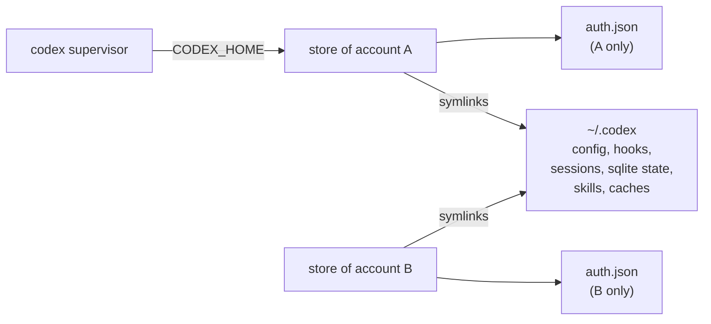
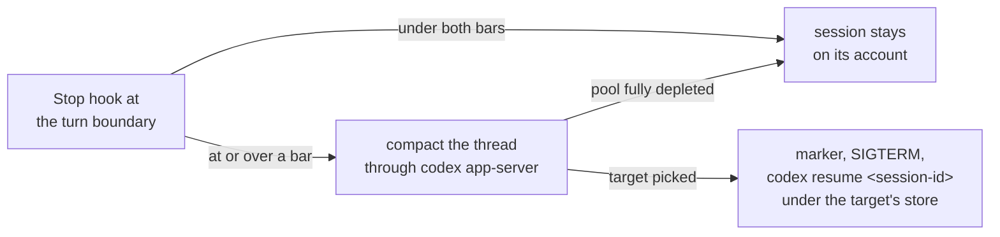
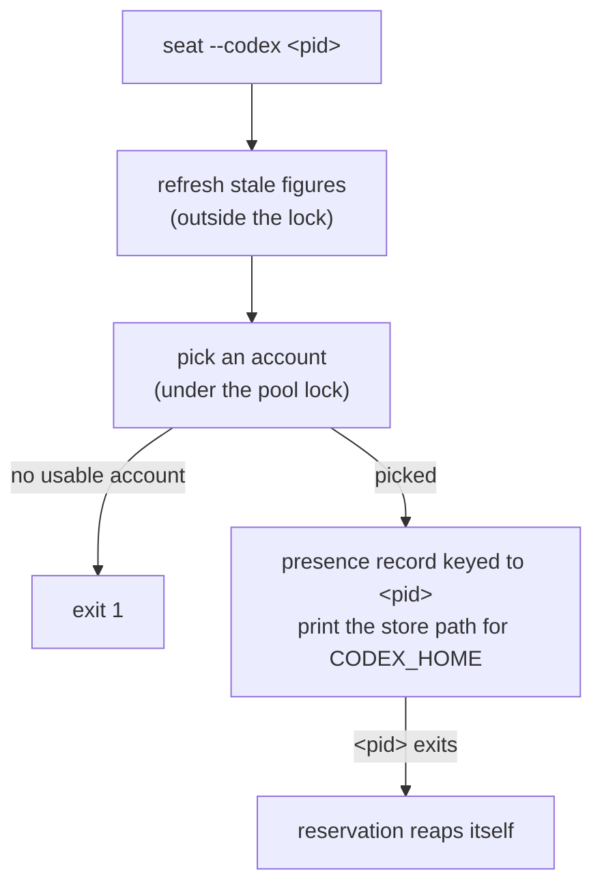

The same pooling works for OpenAI's Codex CLI, against your own ChatGPT-subscription accounts:

```sh
tokenmaxxing init --codex   # log in the first account, isolated, + install the codex supervisor & Stop hook
tokenmaxxing add --codex    # log in another account, isolated - your primary login is untouched
codex                       # use codex as always
```

The Codex pool keeps separate state and shares the engine with the Claude pool:

| Part | What it holds |
| --- | --- |
| Codex pool state (separate) | Its own accounts index, its own per-account stores (0600 files on both platforms, since codex's own store is a plaintext file), and its own lock |
| Engine (shared) | One account model (`id`, `label`, `email`, `tier`, cached `windows`), one picker, one decision, and one set of account commands (`init`, `add`, `auth`, `rm`, and `rename`) |
| Codex provider | Only what differs: identity from `auth.json` (the account id, with the id token's claims for the email and plan), the usage GET and the refresh it needs, the credential store, presence, and the store check before a move |
| codex supervisor and its Stop hook | The restart itself |

The account commands run against the Codex provider when you pass `--codex`. `status` renders every pool and takes no pool flag.

## One store per account, sessions shared

Each pooled account owns one store under the state directory: `codex-stores/<uuid8>/`. Only the credential is namespaced:



- The store holds that account's `auth.json`.
- Every other entry that exists in your real `~/.codex` when a session launches (config, hooks, sessions, sqlite state, skills, caches) is linked into the store by symlink. Transcripts, thread history, and settings stay shared, so `codex resume <session-id>` works across stores.
- An entry created in `~/.codex` after a launch gets its link at the next launch.
- A session runs on an account because the supervisor sets `CODEX_HOME` to that account's store before it spawns codex.

### Which commands run where

| Command | How it runs |
| --- | --- |
| `codex`, `codex resume` | Supervised, on the store the supervisor sets as `CODEX_HOME` |
| `codex exec` (and its alias `codex e`), `codex review`, and a bare `codex app-server`, started with no `CODEX_HOME` | Borrow a pooled account for the life of the process (the [`seat --codex` borrow](#borrowing-for-unattended-consumers)), reserved until the codex process exits, even when the shim is killed first. They run without a supervisor, so they never move. With no usable account, they run on your primary `~/.codex`. |
| `codex exec`, `codex e`, `codex review`, or `codex app-server` with `CODEX_HOME` set | Pass straight through on whatever `CODEX_HOME` the environment names |
| `codex app-server` with a nested command (`daemon start` detaches from the process the reservation is keyed to) | Passes straight through on whatever `CODEX_HOME` the environment names |
| `codex login`, `codex mcp`, and the other non-interactive subcommands | Pass straight through on whatever `CODEX_HOME` the environment names |

A pass-through command runs on your primary `~/.codex` from a plain shell. Launched from inside a supervised codex session, it runs on the session's own store, because the supervisor does not scrub the variable; a nested `codex login` there writes that store.

### Who writes a store

| Writer | When |
| --- | --- |
| tokenmaxxing | At onboarding, when `init`, `add`, or `auth` harvests an isolated login into the store |
| tokenmaxxing | When it reads usage for an account whose access token is about to expire and that has no live session: it runs the refresh itself and stores the rotation at once |
| codex | For an account running in a session: codex refreshes it in place against its own store. An account running in a session is never refreshed from outside. |

- A credential is never copied between stores: a refresh rotation revokes the superseded refresh token, so two stores holding one grant would kill the grant family.
- A refresh that comes back `invalid_grant`, or a reused, expired, or invalidated refresh token, flags the account `needsReauth`, which drops it from placement until `auth --codex`.
- `rm --codex` deletes the whole store directory, symlinks included.

## Why restart is the switch on Codex

A running codex process holds one in-memory auth manager and explicitly refuses to reload `auth.json` when it now names a different account. There is no file watcher and no per-request credential poll, so a credential swapped underneath a running codex never takes effect for inference. Restart is the switch: `codex resume <session-id>` continues the local transcript on whatever account the new process started under.

### The move at a turn boundary

tokenmaxxing handles this with a codex supervisor shim and its Stop hook. At each turn boundary, the Stop hook runs the same decision against the same two bars:



- The hook reads the seat's usage when its cached figure is older than `policy.usagePollTtlMs`.
- Because every codex switch is a visible restart, the automatic codex decision moves only once the session's account is at or over a bar.
- When the session's account is at or over a bar, the hook first compacts the thread on that account through `codex app-server` (`thread/resume`, then `thread/compact/start`), so the resumed session on the fresh account starts from the summary rather than re-uploading the whole history. The compaction is bounded at 3 minutes and best effort; see [Compaction before a move](/switching#compaction-before-a-move).
- When it moves, the hook writes a marker that makes the supervisor SIGTERM the session at the committed boundary and relaunch `codex resume <session-id>` under the target's store, transcript intact (`resume --last` when the hook carried no session id).
- The relaunch prints which account it switched to. Unlike the Claude path, it submits no first prompt, so you type the next turn.
- A marker the supervisor cannot parse stops the session instead of resuming it.
- There is no depleted-pool countdown for codex (nothing can pause a codex session), so a fully depleted codex pool stays put.
- The hook does nothing in a codex started outside the supervisor.
- The hook is declared in `~/.codex/hooks.json` with a 300-second timeout that covers the usage read, the compaction, and the decision.

## Other codex-specific mechanics

### Usage reads

Usage is read from a free authenticated GET against codex's own rate-limit endpoint. The read returns:

- percentages plus absolute epoch reset times
- the aggregate windows and every named additional limit alike
- whether the account holds purchased credits (`credits.has_credits`)

Every named limit screens and triggers against its own bar by duration. Window classification is duration-driven, never position-driven, because current plans may have no 5-hour window at all and the weekly window sits in the primary slot.

An account marked `"credits": true` in `thresholds.accounts` stays usable past its windows unless its latest read reports no credits, which puts it back under its bars (see [How switching decides](/switching#the-bars)).

| Figure | Refreshes |
| --- | --- |
| A seat's figure | In its own Stop hook |
| A parked Codex account's figure | When `status` samples the pool, and when a borrow screens its candidates |

The periodic check tick samples Claude accounts only, so a parked Codex account's figure is as old as the last `status` or borrow, with a passed reset reading as empty. A borrow never refreshes a store's token: an account whose stored access token is within the refresh margin keeps its cached figure until a session or a consumer on that store refreshes it.

### Refresh tokens and presence

Codex refresh tokens rotate, and reusing a superseded one kills the whole grant family. Every rotation tokenmaxxing performs is persisted into the account's own store the instant it returns. Per-session presence files ensure an account running in a live sibling session is never a session placement or move target and never gets its store refreshed from outside; a borrow can still share a codex session's account.

### The file credential store

- Codex requires the file credential store: `init --codex` fails fast when `~/.codex/config.toml` pins `cli_auth_credentials_store` to anything but `file`.
- Every isolated login (`init`, `add`, and `auth`) writes the file-mode setting into its onboarding home so the login lands harvestable.
- `auth --codex <sel>` reauthenticates a pooled Codex account in place through the same isolated login and refuses a login that lands on a different account.

### No active label or manual switch

Codex keeps no pool-wide active label, no post-swap cooldown, and no manual `switch`: each codex session runs on its own account's store and moves on its own, so placement at launch replaces the manual pick.

### Borrowing for unattended consumers

Unattended consumers borrow a pooled account. Borrowing is the supported way onto the pool from outside the supervisor; pointing a consumer at `codex-stores/` directly skips the lock and the presence protocol and can kill a grant family.

| Consumer | How it borrows |
| --- | --- |
| Runs `codex exec`, `codex review`, or `codex app-server` through the shim with no `CODEX_HOME` | The shim borrows for it |
| Spawns its own codex binary (the Codex SDK runs its bundled one) | `tokenmaxxing seat --codex <pid>` |

A long-running process holds its account until it exits and never moves off it, even at a limit. The OpenAI Codex plugin for Claude Code keeps one `codex app-server` per workspace from its first use until a Claude session in that workspace ends. Each workspace that uses the plugin therefore holds a borrow on one Codex account for that span, and once every account is at a limit, the next one runs on your primary `~/.codex`.

`tokenmaxxing seat --codex <pid>` borrows in these steps:



1. Outside the lock, it refreshes the figure of every candidate whose last sample is older than `usagePollTtlMs`. This is the free usage read with the account's stored token, the same read `status` makes, so a consumer that drained an account since the last `status` is screened on the fresh figure.
2. Under the pool lock, it picks among the usable accounts with a readable credential in their store that no pi session holds. The ranking is:
   1. the fewest live sessions and reservations naming the account
   2. on a tie, the highest weekly pace pressure
   3. then the soonest weekly reset
   4. then the lowest weekly usage
3. It writes a presence record keyed to the caller's pid and prints that account's store path for the consumer to pass as `CODEX_HOME`.

Exit 1 means no usable account: fall back to whatever `CODEX_HOME` the environment already names.

The reservation follows these rules:

- A repeat borrow by the same live pid returns its held account rather than moving the reservation, so a consumer never loses presence on a store it may still be using. A held account flagged `needsReauth`, or whose store lost its credential, refuses instead.
- The reservation holds while the pid lives and reaps itself once it exits. A borrowed account is never refreshed from outside or picked for a session mid-run, and a dead consumer never pins an account.
- The codex supervisor re-validates a move target at spawn the same way, so a borrow that lands during a move handoff wins over the stale marker and the session re-picks around it.
- A consumer that runs inside a supervised codex session inherits that session's supervisor id, and a borrow made with that id in its environment never gets that session's account. The Stop hook of the borrowed child compares the supervisor's presence record with the seat in its own `CODEX_HOME` and moves nothing when they differ, so a borrowed child never restarts its parent.

<Callout>
A Codex account serves several borrowers and sessions at once, like a Claude seat, although OpenAI's [CI/CD auth guide](https://learn.chatgpt.com/docs/auth/ci-cd-auth) says "Do not share the same file across concurrent jobs or multiple machines." Codex takes no cross-process lock around a token refresh, so two codex processes on one `auth.json` can send the same refresh token. The loser gets `refresh_token_reused`, and the account can stay signed out until you run `tokenmaxxing auth --codex` for it. Spreading borrowers keeps the number of processes per account low, which makes that race less likely but does not remove it.
</Callout>

### Trusting the Stop hook

Each seat needs one manual step, because codex trusts hooks per store path. Auto-switching stays silently inert on an untrusted seat. `init --codex` prints this reminder.

<Steps>
<Step>
Run `tokenmaxxing init --codex`.
</Step>
<Step>
Open a supervised session on each pooled account.
</Step>
<Step>
Run `/hooks` and trust the tokenmaxxing Stop hook.
</Step>
</Steps>

`tokenmaxxing doctor` lists seats still needing trust:

- It reads the trust state from `~/.codex/config.toml`, keyed by the store's `hooks.json` path and the hook's position in the Stop list. Another Stop hook inserted ahead of tokenmaxxing's resets every seat to untrusted.
- It cannot tell a stale hash from a current one.
