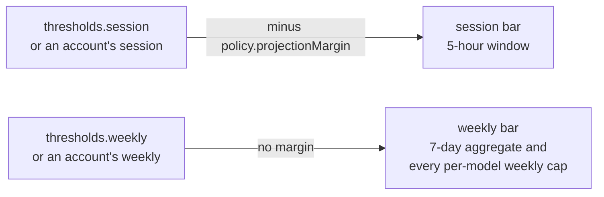
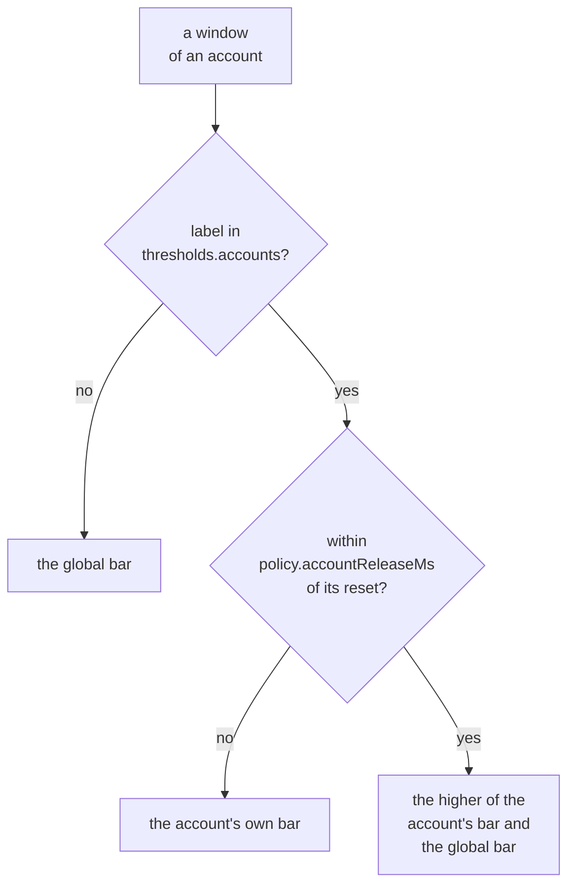

Config is JSON at `~/.config/tokenmaxxing/config.json`. Every field is optional; defaults apply per-field.

```json
{
  "thresholds": {
    "session": 90,
    "weekly": 98,
    "accounts": { "shared-seat": { "session": 75, "weekly": 75 } }
  },
  "claudeBin": "/path/to/real/claude",
  "codexBin": "/path/to/real/codex",
  "grokBin": "/path/to/real/grok",
  "opencodeBin": "/path/to/real/opencode",
  "piBin": "/path/to/real/pi",
  "policy": {
    "projectionMargin": 0,
    "switchModels": ["fable"],
    "usagePollTtlMs": 90000,
    "maxWaitMs": 3600000,
    "checkIntervalMs": 60000,
    "accountReleaseMs": { "session": 1800000, "weekly": 18000000 }
  },
  "hub": { "port": 8317 }
}
```

## Fields

| Field | Default | Meaning |
| --- | --- | --- |
| `thresholds.session` | `90` | The 5-hour session bar, one number. See [Bars](#bars). |
| `thresholds.weekly` | `98` | The weekly bar, covering the 7-day aggregate and every per-model weekly cap. |
| `thresholds.accounts` | `{}` | Per-account thresholds keyed by account label, each with both `session` and `weekly`. See [Per-account bars](#per-account-bars). |
| `"credits"` in a `thresholds.accounts` entry | `false` | Marks an account that carries purchased usage credits. |
| `claudeBin`, `codexBin`, `grokBin`, `opencodeBin`, `piBin` | written by `init` | Pins to the REAL binaries the supervisors and the status-only pools spawn. See [Binary pins](#binary-pins). |
| `policy.projectionMargin` | `0` | Subtracted from the session threshold only. See [Projection margin](#projection-margin). |
| `policy.switchModels` | `["fable"]` | Model families whose per-model weekly cap gates a switch (entries are lowercased on load). |
| `policy.usagePollTtlMs` | `90000` | The shortest sample interval of a Claude account, the one an account near a bar gets. See [Sample interval](#sample-interval). |
| `policy.maxWaitMs` | `3600000` (1 hour) | The depleted-pool auto-wait bound. See [Depleted-pool wait](#depleted-pool-wait). |
| `policy.checkIntervalMs` | `60000`, minimum `10000` | The periodic check tick. See [Check timer](#check-timer). |
| `policy.accountReleaseMs` | `session` `1800000` (30 minutes), `weekly` `18000000` (5 hours) | How close to its reset a window is when a `thresholds.accounts` entry stops holding the account under the global bar. |
| `hub.port` | `8317`, the CLIProxyAPI default | The loopback port the usage hub listens on (`tokenmaxxing serve` and its background service). See [Usage hub](/hub). |

## Bars

`thresholds.session` is both the trigger and the candidate screen, for Claude and Codex alike. See [How switching decides](/switching). The former array form (the session ladder) is rejected: config loading fails with a zod message naming `thresholds.session`.

### Projection margin



- `policy.projectionMargin` is subtracted from the session threshold only, so one large turn is less likely to jump the 5-hour window from under the bar to over the hard limit.
- It must stay below every session threshold, `thresholds.accounts` included.
- The weekly bar takes no margin because a single turn is too small a fraction of the week to overshoot it, and margin there would only strand use-it-or-lose-it headroom.

### Per-account bars



- An account named in `thresholds.accounts` uses its own pair in place of `thresholds.session` and `thresholds.weekly`, in any pool, with the same projection margin on the session threshold, until a window nears its reset.
- `policy.accountReleaseMs` sets how near, with one value for the session window and one for the weekly windows (defaults 1800000 and 18000000, 30 minutes and 5 hours).
- An entry with `"credits": true` (default `false`) marks an account that carries purchased usage credits: its windows never make it exhausted, so it stays usable past 100 percent of them, and its pair ranks it after every account with plan headroom left and moves a session off it to such an account.
- A label that names no pooled account has no effect.

See [How switching decides](/switching#the-bars).

## Binary pins

`init` writes the pin for each pool, and so does `init --pi`. The recursion-guard diagnostic tells you to fix `claudeBin` here when it stops pointing at the real Claude binary.

| Field | Override for one process |
| --- | --- |
| `claudeBin` | `TOKENMAXXING_CLAUDE_BIN` |
| `codexBin` | `TOKENMAXXING_CODEX_BIN` |
| `grokBin` | `TOKENMAXXING_GROK_BIN` |
| `opencodeBin` | `TOKENMAXXING_OPENCODE_BIN` |
| `piBin` | `TOKENMAXXING_PI_BIN` |

Each variable overrides the file value for one process, except that `init` pins the binary it resolved into `config.json`, so an override set for `init` persists.

## Sample interval

Each account's interval follows its cached figures: the window closest to its bar sets it, as 15 minutes times the fraction of that bar still unused, never under `policy.usagePollTtlMs`, so a value above 15 minutes sets every interval. With the default value:

| Account | Sampled |
| --- | --- |
| Empty | every 15 minutes |
| At half its session bar | about every 7.5 minutes |
| Within a tenth of a bar | every 90 seconds |

These accounts get a set interval instead:

| Account | Interval |
| --- | --- |
| Session or weekly aggregate at or over its bar | 15 minutes, or `policy.usagePollTtlMs` when it is longer |
| No session or borrower on this host | 15 minutes, or `policy.usagePollTtlMs` when it is longer |
| No stored figure | `policy.usagePollTtlMs` (see [Periodic check](/switching#periodic-check)) |

How the samplers use it:

- The check tick, `status`, and a seat's sample inside a hook decision all wait out the interval.
- The hook decision samples only when the seat's tee is older than `policy.usagePollTtlMs` or the session's model is a gated family.
- A seat whose sample keeps failing backs off exponentially from its interval, doubling per consecutive failure up to 30 minutes, and resets on the first success.
- A Codex seat reads its usage GET when its cached figure is older than `policy.usagePollTtlMs`.

## Depleted-pool wait

`policy.maxWaitMs` is the depleted-pool auto-wait bound (see [When nothing is usable](/switching#when-nothing-is-usable)):

1. Waiters fill resets within this bound first.
2. When those are full, the overflow waits for the next reset with room, up to twice this bound out.
3. When that horizon is full, the overflow joins the least-crowded reset.

## Check timer

`policy.checkIntervalMs` is the periodic check tick, and every tick evaluates (see [Periodic check](/switching)).

- The default is 60000. The minimum is 10000, because launchd does not spawn a job more than once every 10 seconds by default.
- `init` writes it, rounded up to whole seconds, as the timer's interval. On Linux the systemd `AccuracySec` is a twelfth of it, at least one second.
- The installed timer keeps its old tick until you run `tokenmaxxing init` again.
- With a Nix-managed timer, set `checkTimer.intervalSeconds` to the same value; that option has the same 10-second floor.

## Editing and validation

`tokenmaxxing config` prints the path and the effective values. Edit the file in an editor. A wrong-typed or out-of-range value fails the next load (`check`, `status`, the hooks) with the zod message naming the field. Unknown keys are ignored, the removed `hardThresholds`, `policy.greedySessionFloor`, and `policy.greedySwapMargin` included.
