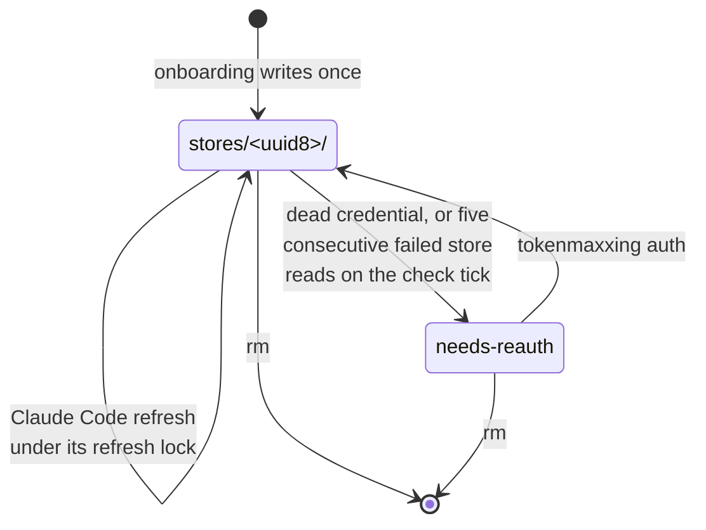
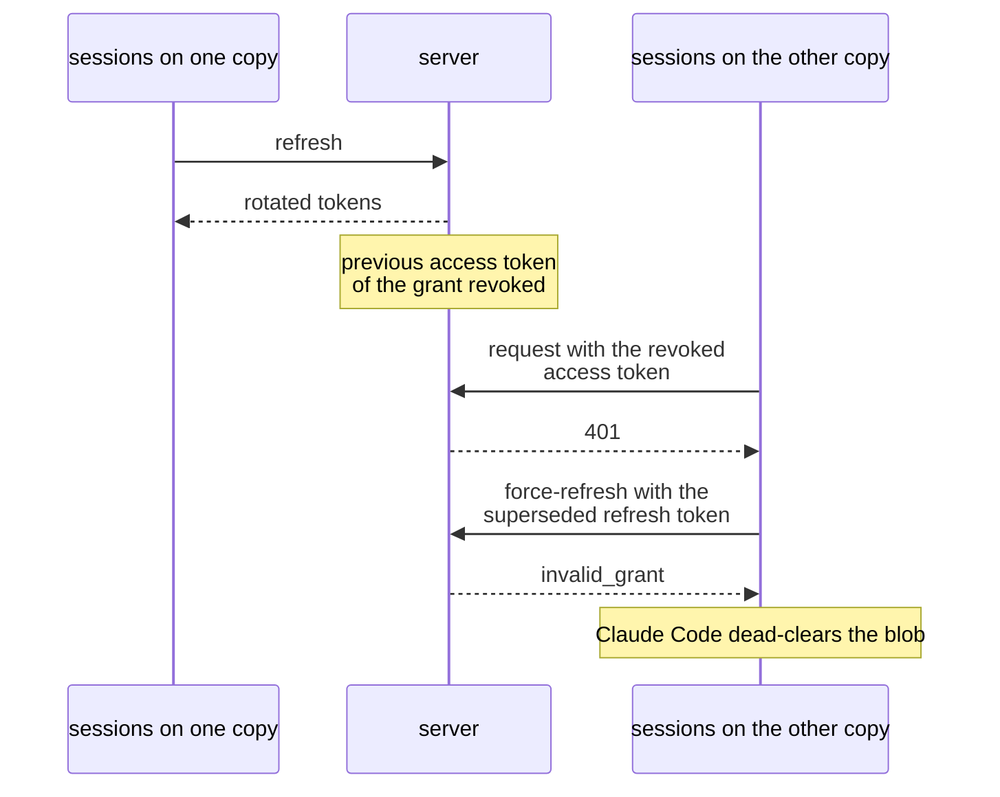
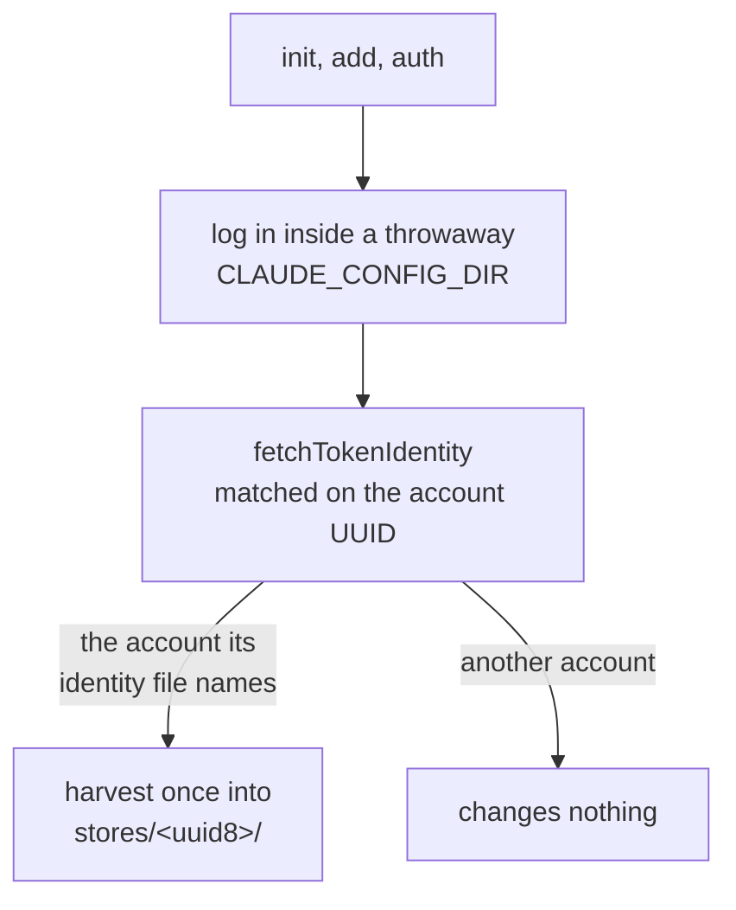
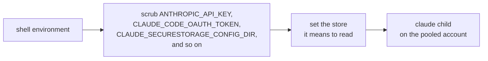
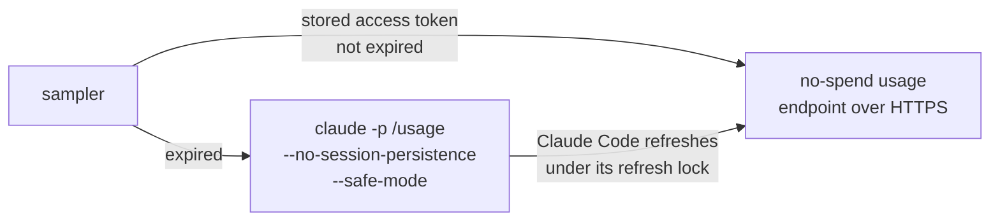
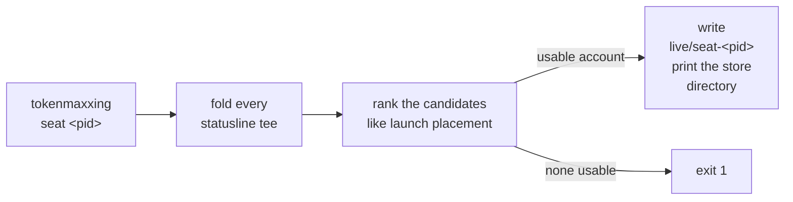
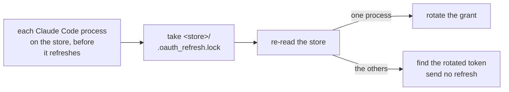

All state lives in `~/.config/tokenmaxxing/`. Each pooled Claude account owns one Claude Code credential store, `stores/<uuid8>/`, named from the first 8 characters of the account id.

A session runs on an account because its `CLAUDE_SECURESTORAGE_CONFIG_DIR` points at that store; Claude Code resolves the credential from that variable first. tokenmaxxing never derives a store from ambient variables: it names the directory itself (the account's store, or a throwaway onboarding home) and computes the same keychain item name Claude Code does.

## Platforms

Credential I/O goes through a single platform-selected store facade; call sites never branch on platform.

| | macOS | Linux |
| --- | --- | --- |
| Where Claude Code keeps a store's credential | a generic-password item in the login keychain | `stores/<uuid8>/.credentials.json` |
| Plaintext on disk | none | the credential file, 0600 in a 0700 directory |
| The tokenmaxxing write | an `add-generic-password` line piped into `security -i` over stdin | atomic: write-to-temp, fsync, then rename |
| Codex, pi, and grok stores | 0600 `auth.json` files | 0600 `auth.json` files |

The other pools are plaintext files on both platforms because those CLIs keep plaintext files themselves.

### macOS keychain item

- **Item name**: `Claude Code-credentials-<sha256(store path)[0:8]>`. The hash is over the NFC-normalized path, so the path must be byte-stable.
- **Account name**: the one Claude Code derives, `$USER` or `os.userInfo().username`. It is `claude-code-user` when that lookup throws, or when the name is empty or holds a character outside letters, digits, `.`, `_`, and `-`. `TOKENMAXXING_KEYCHAIN_ACCOUNT` overrides it.
- **Read**: `security find-generic-password -w`, so the secret only ever appears on stdout. A read that fails for any reason other than a missing item (a locked keychain or a denied ACL, for example) throws, and the account is skipped for that evaluation rather than read as empty.
- **Write**: the one write tokenmaxxing makes pipes an `add-generic-password` line into `security -i` over stdin, so the secret never appears in any process's argv. The interactive mode has a roughly 4 KB line buffer, so an oversized blob falls back to an argv write. The onboarding write stores the `claudeAiOauth` object alone, which stays well under that size.

### Linux file

A write is atomic: write-to-temp, fsync, then rename, so a concurrent reader always sees a whole old or whole new file, never a partial one.

## Rules

### One store per account, never per session

Sessions on the same account share that account's store and coordinate refreshes through Claude Code's own refresh lock, which is rooted at the store. A refresh rotation revokes the previous access token of that grant, so two stores holding one grant break each other:

### Onboarding is the only tokenmaxxing write

- The throwaway home and its credential item are deleted afterwards.
- After onboarding, Claude Code's refresh is the only writer: no harvest, no park, no install, and no refresh grant from tokenmaxxing.
- The login you already had before `init` keeps its own grant in Claude Code's default store, for sessions started outside the supervisor.
- `rm` is the only deletion: it removes the store, its keychain item on macOS, and the account's tee.

### Identity by true owner

Before a harvested login lands in a store, its access token is resolved through the OAuth profile endpoint (`fetchTokenIdentity`, matched on the account UUID). The match never uses the organization, because every seat of a Team plan shares one organization, and never a stored label.

- `auth` refuses a login that lands on a different account than the one being repaired.
- `doctor` runs the same check for every store whose access token is not about to expire. It reports a store past that as unverifiable, because tokenmaxxing holds no refresh grant.

### Dead grants degrade cleanly

- A store whose credential Claude Code cleared after a failed refresh (an empty access token or an empty refresh token) is recognized as dead without spending a request. It flags the account as needs-reauth, and the decision tries the next candidate.
- Five consecutive failed store reads on the check tick flag the account the same way.
- `tokenmaxxing auth` fixes a flagged account in place.

### No token logging

Tokens never appear in the log, in errors, or in command output. Error bodies from the identity endpoint are never surfaced raw; only an allowlisted set of fields survives.

### Spawn hygiene

Every spawned `claude` child that runs on a pooled account (a supervised session, its `/compact` run, and the refresh spawn) scrubs the environment variables claude honors before its store lookup, then sets the store it means to read. A credential exported in the shell therefore never replaces the seat.

| The shell sets | `ANTHROPIC_BASE_URL` |
| --- | --- |
| one of the scrubbed variables | dropped with it, so a gateway configured for another credential never receives a pooled token |
| `ANTHROPIC_BASE_URL` alone, with none of the scrubbed variables | stays; Claude Code sends the pooled token to it the same way it sends your own login's token |

The onboarding login scrubs the same list, so `add` run inside a supervised session does not land the new login in that session's store.

#### The usage read

The direct usage read is the one place a stored access token leaves the store without a `claude` child: every sampler (the check tick, `status`, the seat's in-decision read, and onboarding) sends it to the no-spend usage endpoint over HTTPS. tokenmaxxing holds no refresh grant, so an expired token goes through Claude Code first:

The refresh spawn runs with the account's store set and a throwaway `CLAUDE_CONFIG_DIR`. The sample reads with the token Claude Code wrote, and the throwaway home is deleted afterwards.

## Lending a Claude store

`tokenmaxxing seat <pid>` lends one pooled Claude account to a consumer that starts its own Claude Code, such as a test runner.

- The fold and the ranking run under the pool lock.
- The ranking reads cached figures with every configured per-model cap gating, because the consumer's model is unknown. The command sends no usage read.
- A candidate is an account that is not flagged for reauthentication and holds a usable credential in its store.
- With no usable account the command exits 1, because a borrower cannot wait for a reset.

| Later event | Result |
| --- | --- |
| a repeat call by the same live pid | returns the account it holds |
| a repeat call by the same live pid while the account it holds is flagged for reauthentication or its store lost its credential | refuses |
| the pid exits | the record reaps itself |

### Shared seats

Claude seats are shared: a lent account stays a placement and move target for host sessions and a candidate for other `seat` callers, and each record counts as one session on it. The ranking divides an account's session headroom by its session count plus one and breaks remaining ties by the session count. A burst of `seat` calls therefore spreads across the usable accounts the way a burst of launches does.

### Why the grant stays intact

Every Claude Code process that runs with the store as `CLAUDE_SECURESTORAGE_CONFIG_DIR` takes Claude Code's own refresh lock, `<store>/.oauth_refresh.lock`, and re-reads the store under it before it refreshes:

That holds only when the consumer runs Claude Code with the printed directory itself as `CLAUDE_SECURESTORAGE_CONFIG_DIR`, as the user that owns the store on the host.

| How the consumer uses the store | Result |
| --- | --- |
| the printed directory itself, as the host user that owns the store | works |
| a read-write bind mount of the directory into a container whose process maps to that host user: a rootless runtime that maps the container user to you, or a container user with your uid | works |
| a container process that maps to another host user, root under a rootful runtime included | Claude Code replaces `.credentials.json` with a new 0600 file on each refresh, so the file ends up owned by that user, and the host sessions on the account can no longer read it |
| a copy of `.credentials.json` | one grant in two stores (see [One store per account, never per session](#one-store-per-account-never-per-session)) |
| a single-file bind mount | the refresh lock is in another directory, so the consumer and the host sessions refresh without excluding each other |
