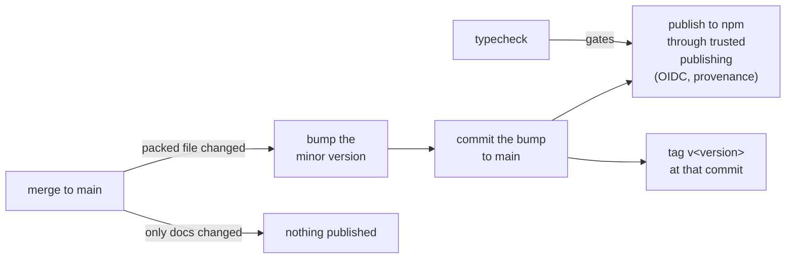
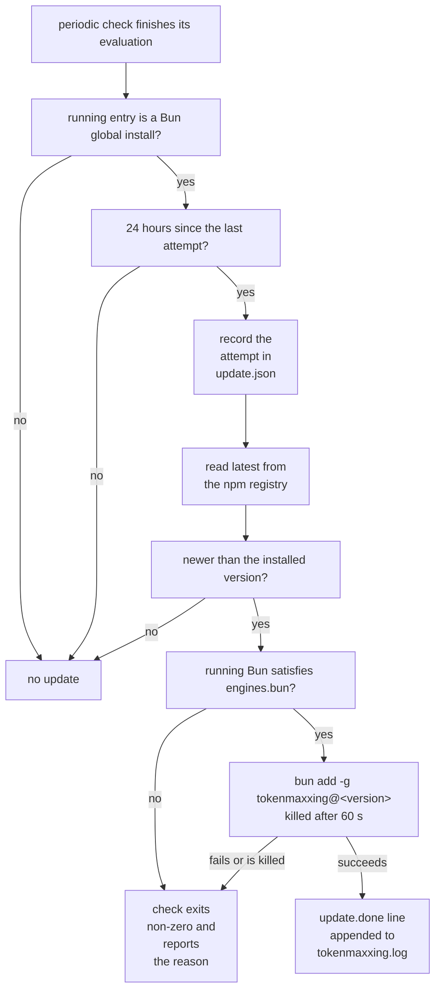
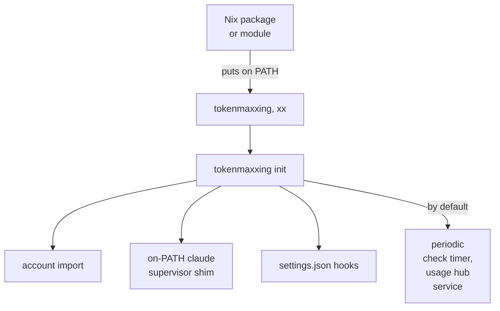

The npm package ships TypeScript source, not a build:

- The `tokenmaxxing` bin points straight at `src/main.ts` with a Bun shebang.
- Bun 1.4.0 or newer runs it as-is. That is why Bun is a hard requirement.

There are no compiled binaries by design. Source run by Bun became the distribution model for two reasons:

- An early release shipped a single 61 MB macOS binary to every platform and failed on Linux with `exec format error`.
- Per-platform compiled packages would each need their own release pipeline.

A merge to main that changes a packed file releases itself through CI:



## Automatic updates

A Bun global install keeps itself current. The periodic account check runs the update after it finishes its evaluation, at most once every 24 hours:



| Install | Updates |
|---|---|
| Bun global install | the periodic check, as above |
| Checkout, including a `bun link` checkout | left alone; its owner updates it |
| Nix | left alone; its owner updates it |
| Codex-only (`init --codex` without the Claude `init`) | no periodic check, so no self-update |

A Codex-only install has no periodic check because the Codex decision reads the figures `status` samples and needs no tick. The Claude `init` installs the timer that drives the update.

### Outcomes

- A successful update appends an `update.done` line with the old and the new version to `tokenmaxxing.log`.
- A failed update makes that check exit non-zero and report the reason. The quota evaluation it already ran still stands.
- The 24-hour clock lives in `update.json` in the state directory. The attempt is recorded before the registry request, so a failing update waits out the day instead of retrying every tick.

### Global root detection

The install is detected from the running entry, not from the environment alone. The global root is the first of these directories whose `node_modules/tokenmaxxing/src/main.ts` is the file that is running:

1. `BUN_INSTALL_GLOBAL_DIR`
2. `BUN_INSTALL/install/global`
3. The `install/global` directory beside the running Bun executable's `bin` directory
4. `~/.bun/install/global`

A timer unit that carries no `BUN_INSTALL` therefore still finds a Bun installed under a custom root. Two shapes read as unmanaged and do not self-update:

- A global directory set only through `BUN_INSTALL_GLOBAL_DIR` is invisible to a timer that does not carry that variable, so the install reads as unmanaged there.
- A package directory that is a symlink (the shape `bun link` creates for a checkout) reads as unmanaged, so a linked checkout is never replaced by registry contents.

### Registry and engine checks

- Both the version read and the install use the public npm registry. `bun add` gets `--registry` explicitly, so a registry mirror configured for Bun through `.npmrc`, `bunfig.toml`, or the environment cannot lag behind the version the check selected.
- A release whose `engines.bun` floor the running Bun does not satisfy is not installed. That check fails visibly with the required range instead, once a day, until Bun is upgraded.
- Credentials embedded in a registry override as URL userinfo authenticate only the version read. They are sent as a request header and never placed on the install command line, where a process listing or the child's error output could expose them.
- An install against an authenticated registry reads its auth from Bun's own `bunfig.toml` or `.npmrc`, as a normal `bun add` would.

### The install child

- It runs from the state directory with the detected global root pinned in its environment (`BUN_INSTALL_GLOBAL_DIR`), so a `bunfig.toml` in the check's working directory cannot redirect it.
- It is killed after 60 seconds, so a stalled registry or package-manager lock cannot hold the check open and block the next tick. A killed install fails that check like any other update failure and waits out the day.
- Its error output goes straight to the check's own stderr (the timer's `check.stderr.log` on launchd, the journal on systemd), so there is no pipe to drain and nothing a descendant of the child can hold.

### Running sessions during an update

An update replaces the installed files in place. A supervisor or session that is already running keeps the version it loaded until it restarts. A hook or supervisor that starts while the replacement is in flight can see a partial tree.

An ordinary package update needs no rerun of `init`: the supervisor shim, the settings entries, and the timer unit all point at the package rather than at a version.

## Nix / nix-darwin

The same source tree is also a flake. It keeps the source-run-by-Bun model (via [bun2nix](https://github.com/nix-community/bun2nix) `writeBunApplication`) and exposes:

| Output | Purpose |
|---|---|
| `packages.default` | `tokenmaxxing` + `xx` on PATH |
| `darwinModules.default` / `withOverlay` | nix-darwin: install the CLI (optional declarative check timer and hub service) |
| `homeManagerModules.default` / `withOverlay` | Home Manager on macOS or Linux (optional declarative check timer and hub service) |
| `nixosModules.default` / `withOverlay` | NixOS system install (optional declarative check timer and hub service) |

### Install

<Tabs items={['Profile', 'One-shot', 'nix-darwin', 'Home Manager']}>
<Tab value="Profile">

Install onto a profile, then run `init`. The profile gives `init`'s supervisor shims a stable `tokenmaxxing` on PATH to resolve.

```sh
nix profile install github:anaclumos/tokenmaxxing
tokenmaxxing init
```

</Tab>
<Tab value="One-shot">

Run once without installing, for help or status only. Do not run `init` this way.

```sh
nix run github:anaclumos/tokenmaxxing -- help
```

</Tab>
<Tab value="nix-darwin">

`darwinModules.withOverlay` adds the overlay so `pkgs.tokenmaxxing` resolves.

```nix
{
  inputs.tokenmaxxing.url = "github:anaclumos/tokenmaxxing";
  modules = [
    inputs.tokenmaxxing.darwinModules.withOverlay
    { programs.tokenmaxxing.enable = true; }
  ];
}
```

</Tab>
<Tab value="Home Manager">

Set the package explicitly, as below, or import `homeManagerModules.withOverlay`. That variant adds this flake's overlay to the pkgs Home Manager uses, the way the darwin and NixOS variants do.

```nix
{
  imports = [ inputs.tokenmaxxing.homeManagerModules.default ];
  programs.tokenmaxxing.enable = true;
  programs.tokenmaxxing.package = inputs.tokenmaxxing.packages.${pkgs.system}.default;
}
```

</Tab>
</Tabs>

### What init still owns

Nix only puts the CLI on PATH. The rest still comes from `tokenmaxxing init`, because it touches credentials and user-owned settings that a pure module should not rewrite:



### Declarative check timer and hub

Set an option below only when you want Nix to own that unit instead of init. Each option exports its own skip variable, so init does not write a second unit.

| Unit | Nix option | Skip variable |
|---|---|---|
| Check timer | `programs.tokenmaxxing.checkTimer.enable = true` | `TOKENMAXXING_SKIP_TIMER=1` |
| Hub service | `programs.tokenmaxxing.hub.enable = true` | `TOKENMAXXING_SKIP_HUB=1` |

When you enable one of them after running `init`, remove the imperative unit once so only the Nix-managed unit runs. The same removal step is in the option descriptions.

| Unit | macOS | Linux |
|---|---|---|
| Check timer | `launchctl bootout gui/$(id -u)/com.tokenmaxxing.check` | `systemctl --user disable --now tokenmaxxing-check.timer` |
| Hub service | `launchctl bootout gui/$(id -u)/com.tokenmaxxing.hub` | `systemctl --user disable --now tokenmaxxing-hub.service` |

- The declarative timer and hub are user-session units, matching init. Headless Linux needs `loginctl enable-linger` for them to run without a login.
- Keep `checkTimer.intervalSeconds` equal to `policy.checkIntervalMs` in seconds, so the documented tick matches the one the unit fires on.

### Dependency expression

When `bun.lock` changes, regenerate the Nix dependency expression:

```sh
bun run nix:bun   # writes bun.nix via bun2nix@2.1.2
```

## License

MIT. Source at [anaclumos/tokenmaxxing](https://github.com/anaclumos/tokenmaxxing).
