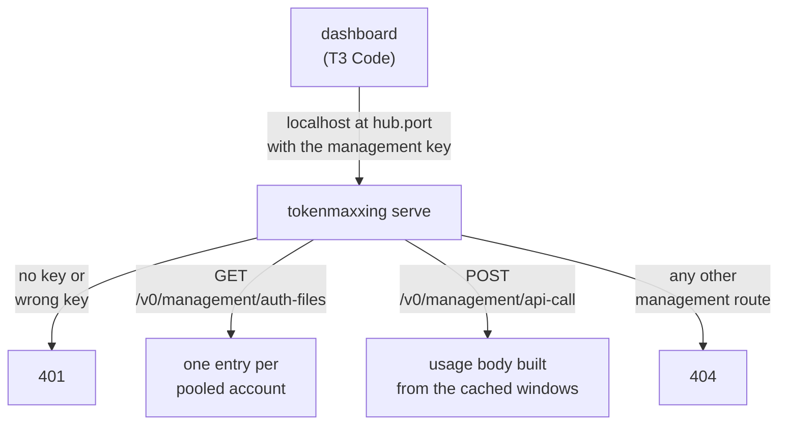
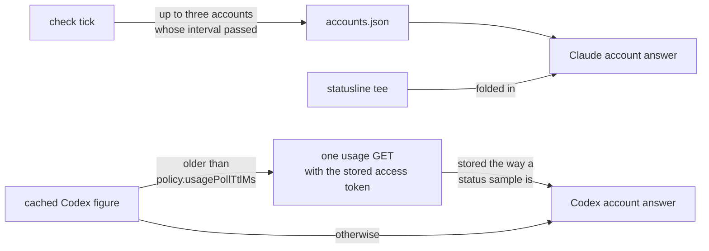
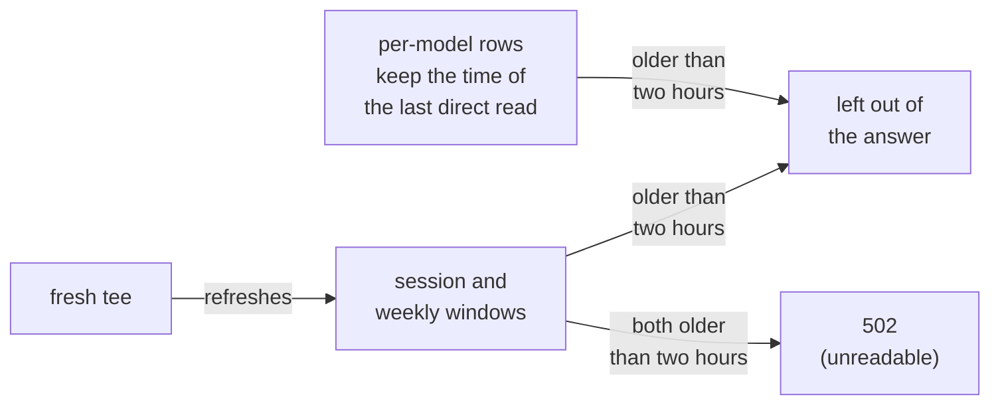

`tokenmaxxing serve` serves the subset of the [CLIProxyAPI](https://github.com/router-for-me/CLIProxyAPI) management API that a usage dashboard reads, so a tool that already polls a CLIProxyAPI hub can show the quota of every pooled Claude and Codex account. T3 Code is the consumer this exists for: its **Add a CLIProxyAPI hub** setting takes a URL and a management key and lists every account the hub pools next to the environment's providers.

```sh
tokenmaxxing serve
```



- **Address**: the server binds the hostname `localhost` on `hub.port` (default 8317, the CLIProxyAPI default; see [Configuration](/configuration)). That is the loopback address the machine's own resolver names, which is where a consumer on the same machine sends `http://localhost:<port>`.
- **Use the `localhost` form**: point the consumer at it, never at the dotted loopback literal. The hub listens on the one address the resolver returns first, so `http://127.0.0.1:<port>` misses it on a machine whose resolver names `::1` first.
- **Background or foreground**: the Claude `init` installs a background service that runs it (a launchd agent on macOS, a systemd user service on Linux), so the hub runs in the background while you are logged in. `tokenmaxxing serve` in a terminal runs it in the foreground until SIGINT or SIGTERM instead.
- **Management key**: the contents of `hub-key` in the state directory. The first run mints a random 64-character key into that file at mode 0600. A key you write there yourself is used as it is when the file is mode 0600; `serve` refuses a key file that other local users can read.
- **Reading the key**: tokenmaxxing never prints the key; read the file and paste it into the consumer.

## Connect T3 Code

1. Make sure the hub runs on the machine that holds the pool: the background service from the Claude `init` is enough (re-run `tokenmaxxing init` to install it), or run `tokenmaxxing serve` in a terminal. The T3 Code environment that should show the accounts runs on the same machine, because the hub listens on loopback.
2. In T3 Code, open the provider settings of that environment and choose **Add a CLIProxyAPI hub**.
3. Enter `http://localhost:8317` as the URL and the contents of `~/.config/tokenmaxxing/hub-key` as the management key.

T3 Code polls the hub on its provider health-check interval (five minutes by default) and shows every pooled Claude and Codex account with its session, weekly, and per-model windows.

## What the hub serves

### Authentication

Authentication is CLIProxyAPI's. The hub reads the key from either header:

- `Authorization: Bearer <key>` (a bare `Authorization` value is taken as the key too)
- `X-Management-Key: <key>`

| Request | Answer |
|---|---|
| Without a key | `401 {"error":"missing management key"}` |
| With a wrong key | `401 {"error":"invalid management key"}` |

### Routes

| Route | Answer |
|---|---|
| `GET /v0/management/auth-files` | `{observed_at, files}` with one entry per pooled Claude and Codex account ([fields](#auth-files-entries)) |
| `POST /v0/management/api-call` | `{status_code, header, body}` with `body` a JSON string ([requests](#api-call-requests)) |
| Every other management route, `reset-quota` and the Codex reset-credit reads included | `404` |

### auth-files entries

| Field | Value |
|---|---|
| `id` | The account id |
| `auth_index` | The first 16 hex characters of the SHA-256 of `<provider>:<account id>`, stable across restarts, the shape CLIProxyAPI derives from a credential file's type and path |
| `name`, `label` | The tokenmaxxing label |
| `type`, `provider` | `claude` or `codex` |
| `email` | Present when known |
| `status` | `active`, or `error` with a `status_message` when the account needs reauth |
| `disabled` | Always `false` |
| `unavailable` | `true` when the account is exhausted under the configured bars, the same screen `status` reports |

### api-call requests

The request body is CLIProxyAPI's (`auth_index`, `method`, `url`, `header`, `data`). Two requests are served. The answer body has the shape the real endpoint returns, built from the cached windows:

| Account | Served request | Body |
|---|---|---|
| Claude | `GET https://api.anthropic.com/api/oauth/usage` | `five_hour`, `seven_day`, and the `weekly_scoped` rows of `limits` |
| Codex | `GET https://chatgpt.com/backend-api/wham/usage` | `plan_type`, `rate_limit` with the cached windows in `primary_window` and `secondary_window` by ascending duration, and `additional_rate_limits` for the named Codex limits |

| Condition | Answer |
|---|---|
| Any other URL or method | `400` |
| An `auth_index` the pool does not hold | `400 {"error":"auth credential not found for auth_index"}` |
| The account's session and weekly windows are both older than two hours | `502` |
| A window older than two hours | Left out of the body |

## Where the figures come from

The hub is a view over the cached figures and never a proxy: it ignores the `header` the client sends and never forwards a request.



### Claude accounts

- The hub never reads a Claude account live. The usage endpoint rate limits each Claude account on its own (an HTTP 429 with a `retry-after` of about an hour).
- The check tick already samples the pool: each tick takes up to three accounts whose sample interval has passed and reads each one, after Claude Code refreshes a stored token that has expired.
- So a Claude account answers from `accounts.json` with the statusline tee folded in: the figure the switching decision reads, at most one tick behind a running session.
- `unavailable` in `auth-files` is computed from the same windows.

### Codex accounts

- No tick samples the Codex pool, so a Codex account is read through the no-refresh path `seat --codex` uses.
- When the cached figure is older than `policy.usagePollTtlMs`, the hub sends one usage GET with the stored access token and stores the result the way a `status` sample is stored. It never rotates the token.
- Otherwise the hub answers with the cached figure.

### The two-hour cutoff



- The protocol carries no sample age, and a stale window whose reset has passed would read as 0 percent used.
- Every cached window carries its own sample time, so the cutoff applies per window: a window older than two hours is left out of the answer.
- An account whose session and weekly windows are both that old is reported as unreadable (`502`), which the consumer renders as an account it could not read.
- Keep the check timer running; `tokenmaxxing status` shows the age of every figure.

## The service unit

The Claude `init` writes the unit beside the check timer and activates it.

| | macOS | Linux |
|---|---|---|
| Unit | `com.tokenmaxxing.hub` | `tokenmaxxing-hub.service` |
| Location | `~/Library/LaunchAgents` | `~/.config/systemd/user` |
| Start and restart | Started at load, restarted after a failed run | Restart on failure |
| stderr | `hub.stderr.log` under the state directory | The journal |
| Stop it | `launchctl bootout gui/$(id -u)/com.tokenmaxxing.hub` | `systemctl --user disable --now tokenmaxxing-hub.service` |

Both run `tokenmaxxing serve` with the state directory `init` ran under. Neither needs a re-run of `init` across updates: the unit points at the installed entry point, not at a version.

| Command or setting | Effect on the unit |
|---|---|
| `tokenmaxxing doctor` | Reports the service |
| `tokenmaxxing uninstall` | Removes it |
| `TOKENMAXXING_SKIP_HUB=1` | Makes `init` skip the unit and `uninstall` leave it alone |
| `programs.tokenmaxxing.hub.enable` | The Nix modules can own it instead (see [Build and distribution](/distribution)) |

### One process holds the port

| Holds `hub.port` | Starts | Result |
|---|---|---|
| The service | A second `tokenmaxxing serve` on the same `hub.port` | Fails at bind and names the unit in its error |
| A foreground `serve` | The service, when it is activated | Retries until that run exits |

Stop one before starting the other. The **Stop it** row of the unit table names the command per platform; `tokenmaxxing uninstall` is not required.

## Limits

- Loopback only. A consumer on another machine needs a tunnel; there is no `allow-remote` setting.
- The service unit comes with the Claude `init`. A Codex-only install (`init --codex` without the Claude `init`) gets no unit; run `tokenmaxxing serve` yourself there.
- The Codex reset-credit reads and `reset-quota` are not served, so the consumer shows no reset credits for a Codex account.
