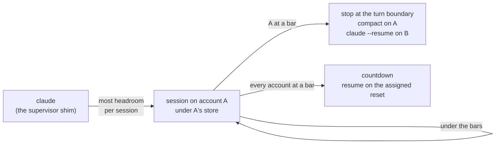

tokenmaxxing is a CLI for automatic Claude Code account switching. It pools multiple subscription (Pro/Max) accounts that you own, starts each `claude` session on the pooled account with the most headroom per running session, and, when the account a session runs on nears a usage limit, resumes that session on a fresher account at a safe turn boundary. You run `claude` exactly as you always do; each session keeps its own account, so several sessions spread across the pool instead of draining one account together.

The visible behavior is a resume: when a session moves, `claude` restarts on the same conversation under the new account. When the whole pool is at its limit and no API key is stored, the session pauses with a countdown and auto-resumes on its assigned reset (at most eight sessions wait on one account; Ctrl-C resumes immediately).

<Callout>
Scope: Claude Code on macOS and Linux, plus OpenAI's Codex CLI as a second pool with its own supervisor and switching, and the pi coding agent on either pool when it signs in with a Claude or ChatGPT subscription (see [pi support](/pi)). A grok pool is status-only: `status` lists its accounts with the weekly credit window and nothing moves (see [Status-only pools](/status-only-pools)). It pools subscription accounts; Anthropic API keys you store with `tokenmaxxing key add` serve as a paid fallback for Claude sessions while every pooled account is at its limit (see [API keys](/switching#api-keys)). This is a personal-use tool for pooling accounts you own, in sessions and agents you run yourself - see [Personal use and terms of service](/terms).
</Callout>

## The problem

A Claude subscription meters three limits at once (all confirmed via `/usage`):

- **Current session**: a rolling 5-hour window.
- **Current week (all models)**: a 7-day aggregate.
- **Current week, per model**: separate weekly caps for individual model families. These currently exist only for Sonnet and Fable, and only the Fable cap is tight enough to matter - it binds well before the aggregate does. A machine can sit at 50% week-all while already at 80% week-Fable.

Weekly quota is use-it-or-lose-it: whatever an account has not consumed by its fixed weekly reset is forfeited. If you own several accounts, the rational strategy is to spread your sessions over them so each account drains at a fraction of the pooled rate, to keep burning quota on whichever account is furthest behind its own weekly pace, and to move a session away before any single limit hits the wall.

Doing that by hand means logging out, logging in, and losing your conversation.

## How it works

Every pooled account gets its own Claude Code credential store, and the thin `claude` supervisor on your PATH points `CLAUDE_SECURESTORAGE_CONFIG_DIR` at the store of the account it placed the session on. A move stops the session at a committed turn boundary (the transcript is already on disk, nothing is lost), compacts the conversation on the account it leaves, and runs `claude --resume <id>` under another account's store with a first prompt that asks Claude to continue. Sessions on the same account share its store, so Claude Code's own token refresh keeps them in step.

Everything else about `claude` is unchanged: all flags, MCP servers, hooks, and skills pass through. Print mode, every `claude` subcommand, and the interactive resume picker run without a seat, on whatever login the environment names (see [Architecture](/architecture)).

## Where to go

<Cards>
  <Card title="Quickstart" href="/quickstart" />
  <Card title="Commands" href="/commands" />
  <Card title="Architecture" href="/architecture" />
  <Card title="How switching decides" href="/switching" />
</Cards>
