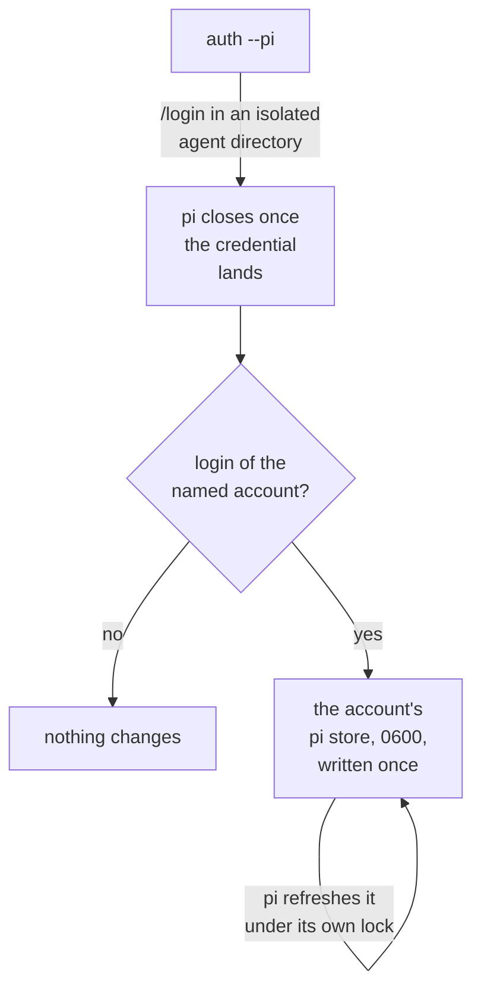
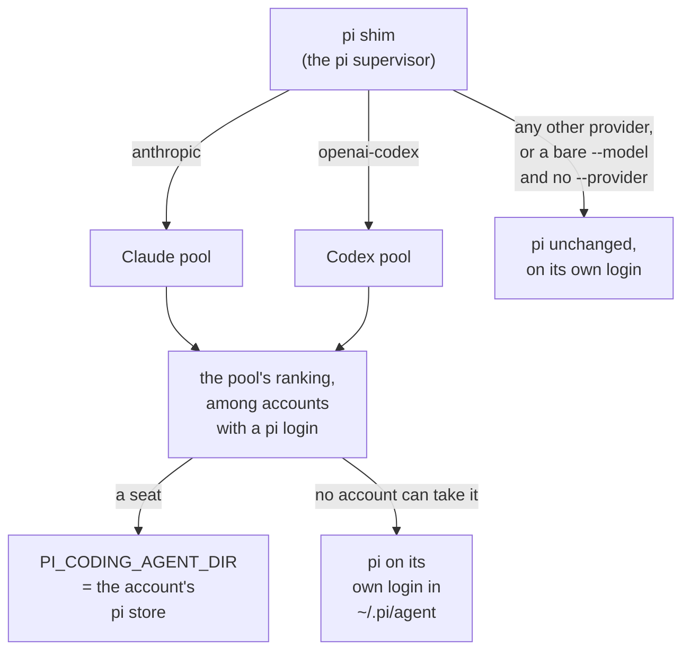
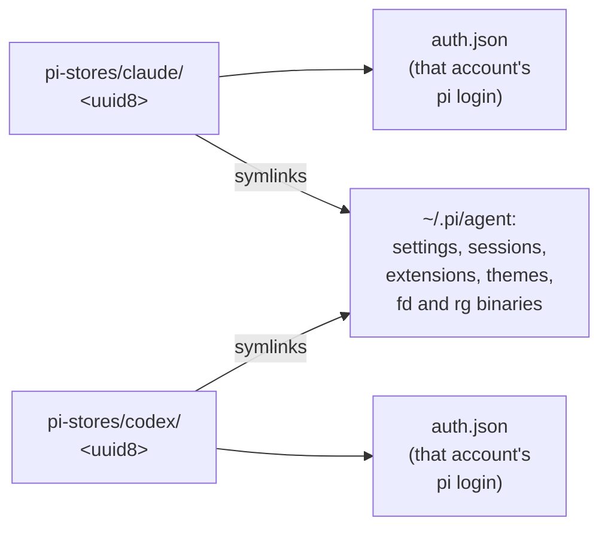
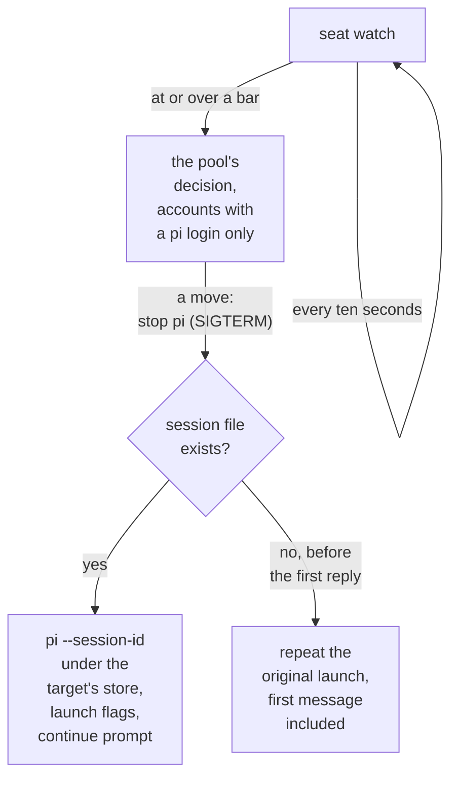

[pi](https://pi.dev) signs in to a Claude subscription or a ChatGPT subscription. tokenmaxxing runs pi sessions on the accounts already in the Claude pool and the Codex pool: the same accounts, the same cached usage, the same bars, and the same ranking as `claude` and `codex` sessions.

| pi provider | Entry in `/login` | Subscription | Pool |
| --- | --- | --- | --- |
| `anthropic` | **Anthropic (Claude Pro/Max)** | Claude | Claude pool |
| `openai-codex` | **OpenAI (ChatGPT Plus/Pro)** | ChatGPT | Codex pool |

<Steps>
<Step>

**Pool the accounts.** An account joins the pool through `tokenmaxxing init` or `add` (Claude) and `init --codex` or `add --codex` (ChatGPT) first. `auth --pi` only gives an account that is already pooled a pi login.

</Step>
<Step>

**Install the pi supervisor.**

```sh
tokenmaxxing init --pi              # verify and pin the real pi, install the pi supervisor
```

</Step>
<Step>

**Log the pooled accounts into pi.**

```sh
tokenmaxxing auth --pi --all        # log every pooled Claude account into pi, one by one
tokenmaxxing auth --pi --codex --all  # same for the pooled codex accounts
```

</Step>
<Step>

**Use pi as always.**

```sh
pi
```

</Step>
</Steps>

## One pi login per account

pi keeps its credential in `auth.json` inside its agent directory, in its own format, and refreshes it itself. That is a different grant from the one in the account's Claude Code store or codex store. tokenmaxxing never copies a grant between stores: a refresh rotation revokes the superseded token, so two copies of one grant break each other. Each pooled account is therefore logged into pi once more; separate logins are separate grants and do not interfere.

### The login



`auth --pi [--codex] [<sel> | --all]` opens pi in an isolated agent directory under the state directory. Run `/login` there, pick the provider, and sign in with the account the command names; pi closes once the credential lands. tokenmaxxing then checks which account the login belongs to:

- **Claude login**: the `accountUuid` the profile endpoint reports.
- **ChatGPT login**: the ChatGPT account id in the access token.

The credential goes to `pi-stores/claude/<uuid8>/auth.json` or `pi-stores/codex/<uuid8>/auth.json` (0600) and is written there once. Afterwards pi is its only writer, and it refreshes the token under its own lock on that file.

### Commands for pi logins

| Command | Effect |
| --- | --- |
| Bare `auth --pi` | Lists the pool and asks which account. |
| `auth --pi [--codex] --all` | Walks every account without a pi login. |
| `rm` | Deletes an account's pi store with its other credentials. |
| `doctor` | Reports accounts without a pi login and checks the identity of every pi login whose access token is still fresh. |

## One store per account, sessions shared

The `pi` shim on your PATH runs the pi supervisor. It picks the pool from the provider pi starts on, then picks the seat.



### Which provider pi starts on

The supervisor reads the provider from:

- `--provider`.
- The provider prefix of `--model` (`anthropic/claude-opus-4-8`).
- Without `--model`, `defaultProvider` from `~/.pi/agent/settings.json`, which pi writes when you pick a model, or from the project's `.pi/settings.json` when pi trusts the project.

pi trusts the project in any of these cases:

- `--approve`.
- A trust decision for the directory or a parent in `~/.pi/agent/trust.json`.
- With no decision, `defaultProjectTrust: "always"` in the global settings.

<Callout>
A project whose trust pi would ask about at startup counts as untrusted. As a result, answering pi's prompt with trust can start the session on the project's provider while the seat belongs to the global default's pool. pi then falls back to a model whose provider has a credential in that session, which is the seat's provider unless an API key in the environment names another.
</Callout>

A settings file that does not parse is skipped with a log line, as pi skips it.

A bare `--model` with no provider prefix and no `--provider` runs pi unchanged, because pi resolves a bare model id across every provider's catalog. Write `--model anthropic/<id>` or add `--provider`.

### The store



The store holds only `auth.json`. Every other entry in `~/.pi/agent` (settings, sessions, extensions, themes, the managed `fd` and `rg` binaries) is linked into it by symlink, and pi writes those files in place, so settings and transcripts stay shared across accounts.

A file pi creates for the first time inside a store stays in that store. So before linking, tokenmaxxing creates the shared entries pi writes when `~/.pi/agent` lacks them:

- `settings.json`, `models-store.json`, and `trust.json`, as `{}`.
- The `sessions` and `bin` directories.

### Presence records

| Account | Presence record | Effect |
| --- | --- | --- |
| Claude | Under `live/` | Counts as a session on that account, so `claude` placement spreads around it and the check tick samples its account first. |
| ChatGPT | Under `codex-live/` | Holds the account the way a codex session does: no other codex or pi session and no `seat --codex` borrower is placed there, and nothing else refreshes that account's codex store while the session runs. |

The pi supervisor that holds a ChatGPT account refreshes the codex store token itself when it expires, because no codex process uses that store meanwhile, so its usage reads keep working for the whole session.

## Moves

pi runs no hook tokenmaxxing can use, so the supervisor watches its own seat every ten seconds.



### What the watch reads

| | Claude account | ChatGPT account |
| --- | --- | --- |
| Source | The cached figure and the account's statusline tee. | Codex's usage endpoint, read with the account's codex store token when the cached figure is older than `policy.usagePollTtlMs`. |
| Freshness | The check tick refreshes the cached figure at the account's sample interval. The timer comes from `tokenmaxxing init`, and `init --pi` warns when it is not active. | After a failed read, the supervisor logs `pisupervisor.seat_unmeasured` and waits a minute before the next one. |
| Fully depleted pool | The same countdown as a `claude` session (Ctrl-C resumes at once). | Nothing waits. |

### The relaunch

On a move the supervisor stops pi (pi restores the terminal on SIGTERM) and relaunches `pi --session-id <id>` under the target's store with the launch flags and a first prompt that asks the model to continue. pi restores the session's model on resume. A turn in flight is cut; its completed messages are in the session file.

### Session ids

The supervisor owns the session id so that a relaunch reopens the same conversation.

| Launch | Result |
| --- | --- |
| A new session | Gets `--session-id <uuid>`. |
| `--continue` | Resolves to the most recent session for the current directory. |
| `--session` with an id or a unique id prefix of a session in the current directory | Becomes `--session-id` with the full id. |
| `--session-id` or `--fork` | Kept. |

### Runs the supervisor leaves alone

These run pi unchanged, on the login the environment names:

- The subcommands: `install`, `remove`, `uninstall`, `update`, `list`, `config`, and `auth`.
- `-p`, `--mode json`, and `--mode rpc`.
- Any run whose stdin or stdout is not a terminal (pi runs print mode then).
- `--resume` and `--no-session`.
- `--session` with a path or with an id from another directory.
- `--api-key`, `--export`, `--list-models`, `--help`, and `--version`.

## Limits

- **One subscription per session.** A pi store holds only the seat's credential, so a session on a Claude account cannot switch to an `openai-codex` model, or to a provider whose login lives in `~/.pi/agent/auth.json`, without a restart; start pi with `--provider` or `--model` for the other one. Providers read from environment variables still work.
- **No move on a refusal.** tokenmaxxing sees no pi error, so a limit the server enforces before the cached figure reaches a bar (a per-model cap with no cached row, for example) shows as pi's own error until the watch reads the figure. Per-model gating follows `--model`; a launch without it gates every family in `policy.switchModels`, as a `claude` launch without `--model` does.
- **No compaction before a move.** The resumed session sends the full conversation to the new account.
- **A move before the first reply repeats the launch.** pi writes a session file only after the first reply lands, and no tool runs before that reply, so when the session file does not exist yet the relaunch repeats the original launch, first message included, instead of sending the resume prompt. A launch into a fully depleted Claude pool takes this path after the countdown.
- **Shared settings writes.** pi locks `settings.json`, `trust.json`, and `models-store.json` through the path it opened, and each store opens its own link, so two sessions on different accounts that rewrite the same shared file at the same moment can lose one of the two writes.

pi's Claude login is pi's own use of a Claude subscription; the [personal-use terms](/terms) apply to it as they do to every pool.
