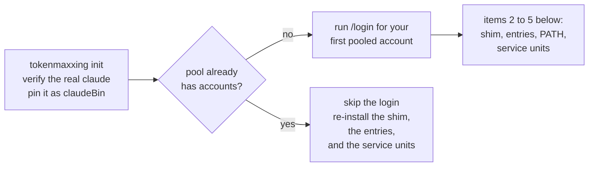

Requires [Bun](https://bun.sh) and Claude Code, on macOS or Linux.

<Steps>
<Step>

### Install the CLI

Install with Bun, or from the flake if you already use Nix / nix-darwin. Put the CLI on PATH before `init` (see [Build and distribution](/distribution)).

<Tabs items={['Bun', 'Nix']}>
<Tab value="Bun">

```sh
bun add -g tokenmaxxing
```

</Tab>
<Tab value="Nix">

Nix users replace the Bun step with this command, or enable `programs.tokenmaxxing` in their nix-darwin or Home Manager config:

```sh
nix profile install github:anaclumos/tokenmaxxing
```

</Tab>
</Tabs>

</Step>
<Step>

### Run `init`

```sh
tokenmaxxing init
```



`init` first verifies the real `claude` binary and pins its path as `claudeBin` in `config.json`, then does five things:

1. **Login.** Starts an isolated `claude` session in a throwaway config home and asks you to run `/login` there (the browser sign-in) for your first pooled account.
   - It asks even if you are already signed in, and it keeps your existing login available to Claude sessions started outside the supervisor.
   - The login lands in that account's own credential store; the one you already have is never copied.
2. **Supervisor shim.** Installs the `claude` supervisor shim, beside the `tokenmaxxing` and `xx` entry points, in `~/.config/tokenmaxxing/bin/`.
3. **Claude Code entries.** Installs five entries in Claude Code's `settings.json`: a statusLine, a subagentStatusLine, a Stop hook, a StopFailure hook, and a SessionStart hook.
4. **PATH.** Adds the bin directory to PATH in your shell rc when it does not already sit ahead of the real `claude` (idempotent, marked with a `# tokenmaxxing PATH` comment). On a Nix-managed or unwritable rc it prints the line to add instead.
5. **Service units.**
   - A periodic check timer (a launchd agent on macOS, a systemd user timer on Linux) that runs `tokenmaxxing check` once per tick (`policy.checkIntervalMs`, 60 seconds by default).
   - A usage hub service that runs `tokenmaxxing serve` for a dashboard such as T3 Code (see [Usage hub](/hub)).

</Step>
<Step>

### Add more accounts

Restart your shell, then add more accounts:

```sh
tokenmaxxing add        # logs one more account in, in isolation, and pools it
```

</Step>
<Step>

### Run `claude`

```sh
claude                  # use claude as always
```

Each `claude` you start is placed on the pooled account with the most session headroom per running session, so two sessions land on two accounts.

</Step>
</Steps>

`xx` is a second entry point for `tokenmaxxing`. Bare `tokenmaxxing` (or `xx`) runs `status`.
