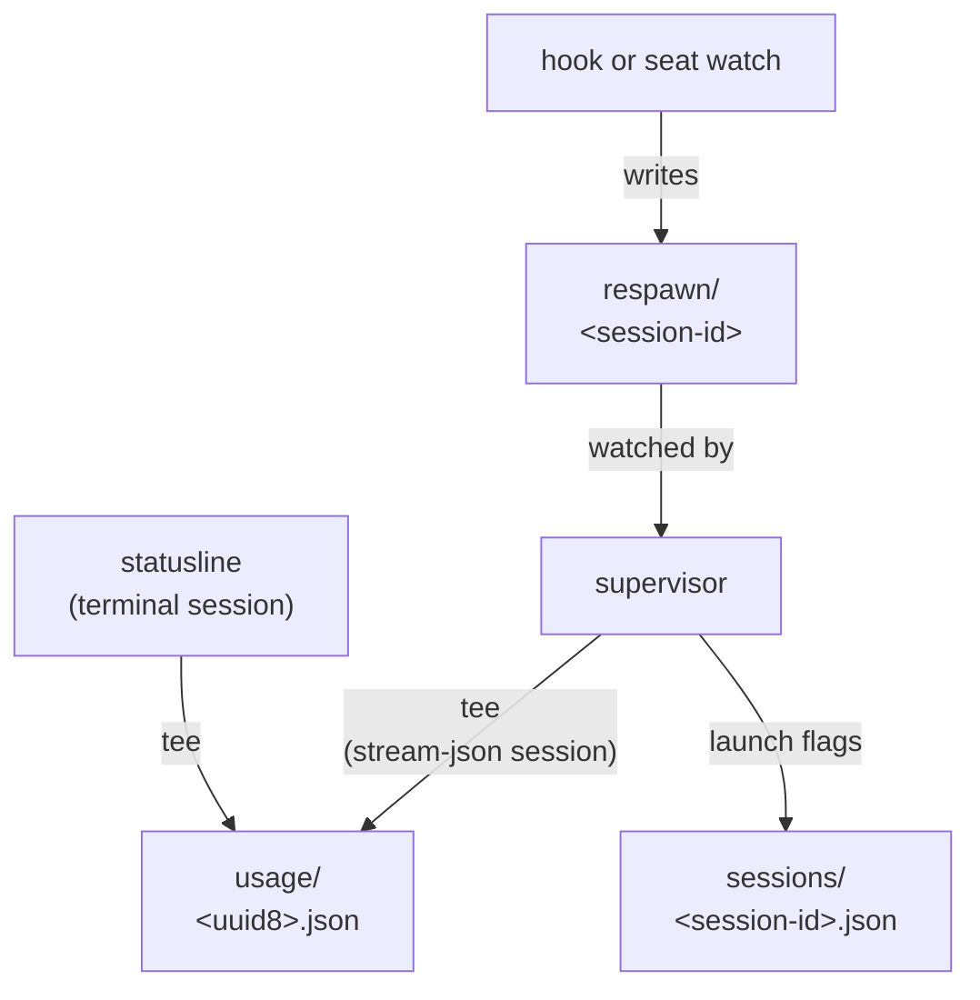
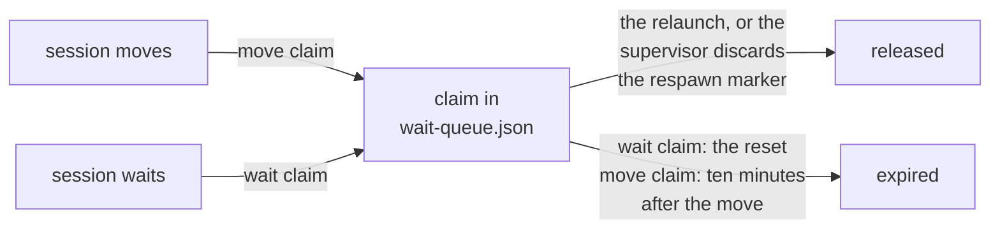
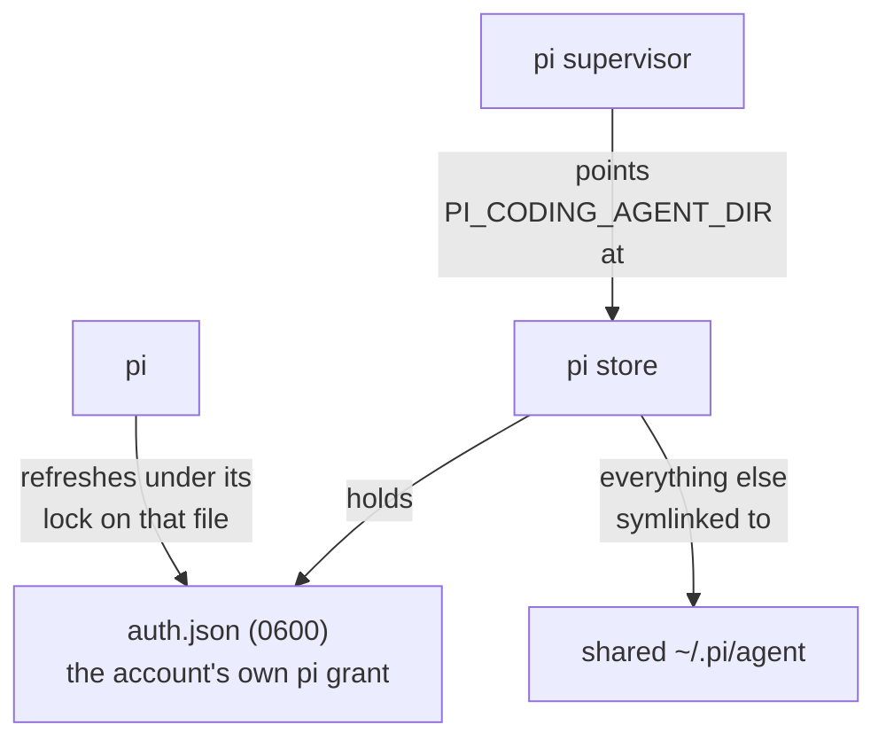

Everything lives under `~/.config/tokenmaxxing/`. Override with `TOKENMAXXING_HOME`.

<Callout title="Hermetic runs">
Every external path has an env override so tests stay hermetic. The timer and hub units are not paths, so:

- A hermetic run of `init` builds a full isolated `HOME` and sets `TOKENMAXXING_SKIP_TIMER=1` and `TOKENMAXXING_SKIP_HUB=1`.
- `uninstall` addresses the login user's service instances only when `HOME` is the login home (see [Troubleshooting](/troubleshooting)).
</Callout>

## Layout

The tree lists the entries in the order of the sections below. Open a folder to see the entries this page names inside it.

<Files>
  <Folder name="~/.config/tokenmaxxing" defaultOpen>
    <File name="config.json" />
    <File name="accounts.json" />
    <File name="lock" />
    <Folder name="stores">
      <Folder name="<uuid8>">
        <File name=".credentials.json (Linux only)" />
      </Folder>
    </Folder>
    <Folder name="onboard" />
    <Folder name="usage">
      <File name="<uuid8>.json" />
    </Folder>
    <Folder name="live">
      <File name="<session-id>" />
      <File name="seat-<pid>" />
    </Folder>
    <Folder name="sessions">
      <File name="<session-id>.json" />
    </Folder>
    <Folder name="respawn">
      <File name="<session-id>" />
    </Folder>
    <File name="wait-queue.json" />
    <Folder name="bin">
      <File name="claude" />
      <File name="codex" />
      <File name="pi (after init --pi)" />
      <File name="tokenmaxxing" />
      <File name="xx" />
    </Folder>
    <File name="tokenmaxxing.log" />
    <File name="tokenmaxxing.log.old" />
    <File name="spawnrate.json" />
    <File name="update.json" />
    <File name="update.lock" />
    <File name="check.stderr.log (macOS only)" />
    <File name="hub.stderr.log (macOS only)" />
    <File name="hub-key" />
    <File name="codex-accounts.json" />
    <File name="codex-lock" />
    <Folder name="codex-stores">
      <Folder name="<uuid8>">
        <File name="auth.json" />
      </Folder>
    </Folder>
    <Folder name="codex-onboard" />
    <Folder name="codex-respawn" />
    <Folder name="codex-live">
      <File name="seat-<pid>" />
    </Folder>
    <Folder name="pi-stores">
      <Folder name="claude">
        <Folder name="<uuid8>">
          <File name="auth.json" />
        </Folder>
      </Folder>
      <Folder name="codex">
        <Folder name="<uuid8>">
          <File name="auth.json" />
        </Folder>
      </Folder>
    </Folder>
    <Folder name="pi-onboard" />
    <File name="grok-accounts.json" />
    <File name="grok-lock" />
    <Folder name="grok-stores">
      <Folder name="<uuid8>">
        <File name="auth.json" />
      </Folder>
    </Folder>
    <Folder name="grok-onboard" />
    <File name="opencode-go-accounts.json" />
    <File name="opencode-go-lock" />
    <Folder name="opencode-go-stores">
      <Folder name="<uuid8>">
        <File name="auth.json" />
      </Folder>
    </Folder>
    <Folder name="opencode-go-onboard" />
    <Folder name="opencode-go-live">
      <File name="seat-<pid>" />
    </Folder>
  </Folder>
</Files>

### Configuration and accounts

| Path | What it holds |
|---|---|
| `config.json` | Your configuration (sparse; defaults apply per field) |
| `accounts.json` | Non-secret index of pooled Claude accounts, never tokens. The index names no active account: there is no pool-wide active account, each session has its own seat. Fields: [Account index fields](#account-index-fields) |
| `lock` | The `flock` file that serializes decisions, placement, and sampling |
| `stores/<uuid8>/` | One Claude Code credential store per pooled account. On Linux it holds the account's `.credentials.json` (0600 in a 0700 directory) and Claude Code's refresh lock. On macOS the credential is the keychain item keyed by this path, and the directory holds only the lock |
| `onboard/` | Throwaway config home for `init`, `add`, and `auth` logins (deleted after harvest, credential included) |

### Account index fields

Each account in `accounts.json` has these fields.

- Required: `id`, `label`, `email`, `tier`, `addedAt`, and `windows`.
- Optional: `lastUsageAt`, `lastProbeAt`, `probeFails`, `storeFails`, `usageRetryAt`, `enforcedUntil`, `needsReauth`, and `oauthAccount`.

| Field | What it holds |
|---|---|
| `windows` | The cached windows: the session and weekly windows unnamed, per-model caps named, each with its duration and sample time |
| `probeFails` | Consecutive failed seat samples, for the backoff |
| `storeFails` | Consecutive failed store reads on the check tick; five stamp `needsReauth` |
| `usageRetryAt` | The time the `retry-after` of the usage endpoint's HTTP 429 names; no usage read is sent for the account before it |
| `oauthAccount` | The object used to verify identity on `auth` |

A window is `{name, usedPercentage, resetsAt, windowSeconds, sampledAt}`. `name` is `null` for the session and weekly windows and the limit or model name otherwise.

### Running sessions

| Path | What it holds |
|---|---|
| `usage/<uuid8>.json` | The tee per account: the aggregate window snapshot pushed by the sessions running on that account. Its mtime is the feed's liveness heartbeat |
| `live/<session-id>` | One PID-validated presence file per running supervised Claude session: the account id, the pid, and the start time |
| `live/seat-<pid>` | One record per Claude account lent by `seat <pid>`, validated against that pid |
| `sessions/<session-id>.json` | Per-managed-session launch flags the supervisor persists for respawns, plus `current`, the live session id after a `/clear` or an in-session `/resume`. Pruned after 30 days idle (matching claude's own transcript retention), never while the session's record under `live/` exists |
| `respawn/<session-id>` | Respawn markers the supervisor watches (fields below) |
| `wait-queue.json` | One `{sessionId, accountId, at, waitUntil}` claim per supervised session that is moving or waiting, naming the account it relaunches on (lifecycle below) |

Placement counts each record under `live/` as one session on its account, and `rm` refuses an account with a living record.

A respawn marker holds:

- the target account
- the session to resume
- a `waitUntil`: now for a plain move, the reset for a depleted-pool wait
- whether to compact first
- the origin: the hook or the seat watch that wrote it, which picks the resume prompt
- the launch time of the process the marker was written for
- after a usage-credits refusal, the accounts that have refused the session

A `wait-queue.json` claim ends one of two ways:

- Placement counts a claimed session on the account its claim names.
- At most eight sessions wait on one account while the rest take the next reset with room, or the least-crowded reset when the horizon is full.

### Shims, logs, and service files

| Path | What it holds |
|---|---|
| `bin/` | The PATH shims: `claude`, `codex`, `pi` (after `init --pi`), and the `tokenmaxxing` / `xx` entry points |
| `tokenmaxxing.log` | Append-only event log, rotated to `tokenmaxxing.log.old` once it passes 5 MB |
| `spawnrate.json` | The time and process id of each wrapper entry in the last 30 seconds, which the recursion guard reads to find a chain of nested entries |
| `update.json`, `update.lock` | The last self-update attempt's timestamp and the `flock` file that serializes it (Bun global installs only; see [Automatic updates](/distribution#automatic-updates)) |
| `check.stderr.log`, `hub.stderr.log` | macOS only: the launchd check job's and hub service's stderr (systemd sends it to the journal) |
| `hub-key` | The management key `tokenmaxxing serve` requires, mode 0600, minted on the first run; a key written by hand is used as it is. See [Usage hub](/hub) |

### Codex pool

The `codex-*` entries are the Codex pool's own state.

| Path | What it holds |
|---|---|
| `codex-accounts.json` | The same index shape as `accounts.json`, without `oauthAccount`. No active account either: each session has its own seat |
| `codex-stores/<uuid8>/` | One store per pooled Codex account: its `auth.json`, everything else symlinked to the shared `~/.codex` |
| `codex-live/` | One PID-validated presence file per running supervised codex session, and one `seat-<pid>` reservation per borrow, validated against the pid the record names (table below), so a live account is never a session placement or move target |

| Borrow | Its `seat-<pid>` record names |
|---|---|
| `seat --codex` | The caller's pid |
| A shim-run `exec`, `e`, `review`, or bare `app-server` | The codex child's pid |

A borrow picks the account the fewest records name.

### pi stores

| Path | What it holds |
|---|---|
| `pi-stores/claude/<uuid8>/`, `pi-stores/codex/<uuid8>/` | One pi store per pooled Claude or Codex account that has a pi login, laid out as the diagram shows |
| `pi-onboard/` | Throwaway pi agent directory for `auth --pi` logins (deleted after harvest, credential included) |

A pi session's presence record goes to `live/` or `codex-live/`. See [pi support](/pi).

### Status-only pools

The `grok-*` and `opencode-go-*` entries are the state of the two status-only pools. See [Status-only pools](/status-only-pools).

| Path | What it holds |
|---|---|
| `grok-accounts.json`, `opencode-go-accounts.json` | The same index shape |
| `grok-stores/<uuid8>/auth.json`, `opencode-go-stores/<uuid8>/auth.json` | One 0600 store per account |
| `grok-onboard/`, `opencode-go-onboard/` | Throwaway login homes |
| `opencode-go-live/` | One `seat-<pid>` record per key lent by `seat --opencode-go`, validated against that pid |

## Outside the state directory

| Target | What tokenmaxxing does with it |
|---|---|
| Claude Code's `settings.json` | Touches the hook and statusline entries |
| The keychain items of its own stores (macOS) | Touches them |
| codex's `hooks.json` | Touches it |
| The periodic-check and usage-hub units in launchd or systemd | Touches them |
| Your shell rc | Touches the `# tokenmaxxing PATH` line |
| codex's `config.toml` | Reads the credential-store setting and hook trust, and never writes it |
| pi's `settings.json` and `trust.json`, and a project's `.pi/settings.json` | Reads them to pick a pi session's pool and session directory |
| `~/.pi/agent` | Creates only what is missing among `settings.json`, `models-store.json`, and `trust.json` (as `{}`) and the `sessions` and `bin` directories, so that every pi store can link them |

Every onboarding login runs in a throwaway home under the state directory, never in the vendor CLI's own. tokenmaxxing no longer writes `~/.claude.json`, Claude Code's default credential store, or codex's live `auth.json`.

## After upgrading

### Rebuild the pool

Version 1.37.0 moves every Claude credential into a per-account store, and the Codex pool moves to per-account stores the same way. Neither pool has a migration: rebuild it. `init` and `add` write the store from a fresh grant, and the index keeps its records, so labels and cached figures survive.

| | Claude pool | Codex pool |
|---|---|---|
| A session the pool's supervisor starts runs on | `stores/<uuid8>/` and nothing else | `codex-stores/<uuid8>/` and nothing else |
| Log in the first account | `tokenmaxxing init`, through an isolated browser sign-in | `tokenmaxxing init --codex`, through an isolated device-auth login |
| Log in each other account | `tokenmaxxing add` | `tokenmaxxing add --codex` |
| Index that keeps its records | `accounts.json` | `codex-accounts.json` |
| Retired state | Not read: the parked backups earlier versions kept (the `creds/` files on Linux, the `tokenmaxxing-cred-<uuid8>` keychain items on macOS), the copy in Claude Code's default store, and the old backups `usage.json`, `lastswap.json`, `depleted.json`, and the `sample/` probe homes the retired `/usage` sampler left behind. Not written: Claude Code's default store | Not read or written: the shared live `auth.json` rewrite, the `codex-creds/` parked copies, the `activeId` label, the `codex-lastswap.json` cooldown clock, and the `codex-reconcile/` signals |
| Delete yourself | `creds/` (it holds credentials), `usage.json`, `lastswap.json`, `depleted.json`, `sample/`, and the `tokenmaxxing-cred-<uuid8>` keychain items | `codex-creds/` (it holds credentials), `codex-lastswap.json`, and `codex-reconcile/` |
| Keeps your own login for sessions started outside the supervisor | Claude Code's default store | Codex's default `~/.codex/auth.json` |

### Index schema

`accounts.json` and `codex-accounts.json` are schema version 2:

- `version` is `2`, and `accounts` is the array.
- There is no active field. A file that still carries `activeId` loads and drops the key on the next save.
- A version 1 index fails the schema check, and every command throws `does not match its schema` until the file is repaired or removed.

The account fields and the window shape are in [Account index fields](#account-index-fields).
