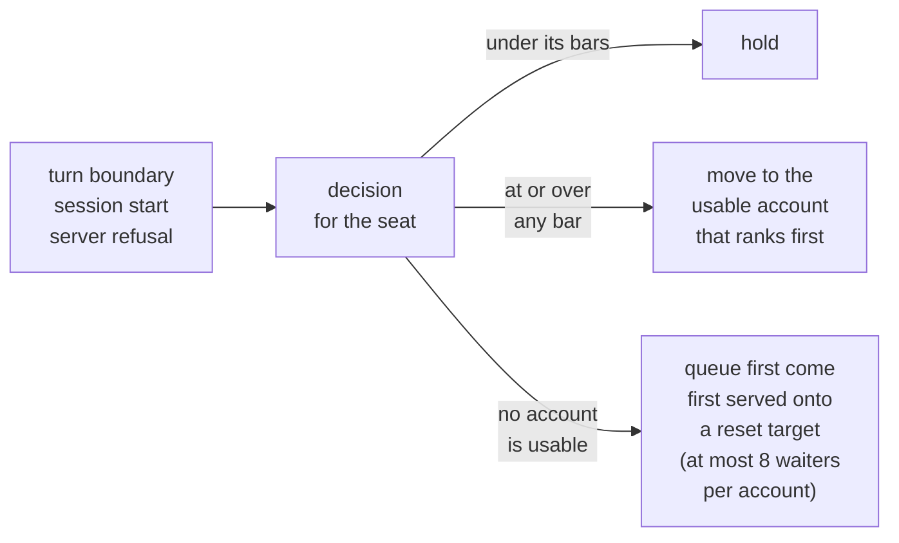
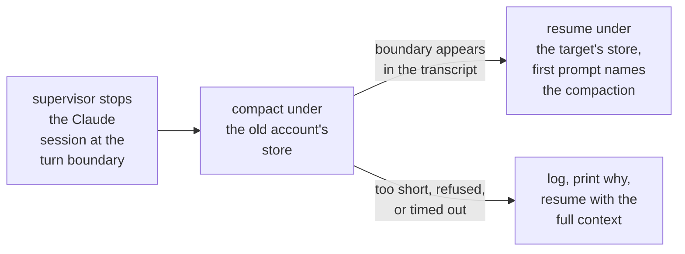
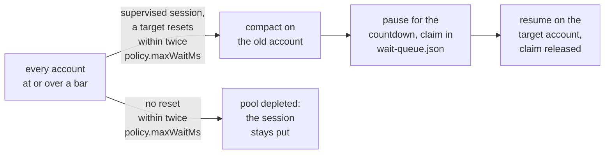
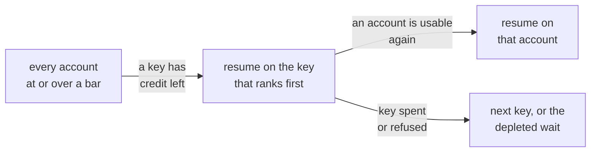
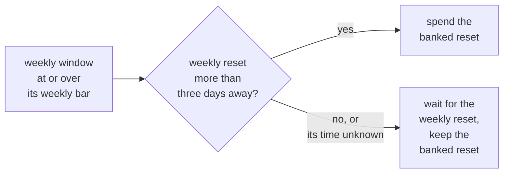
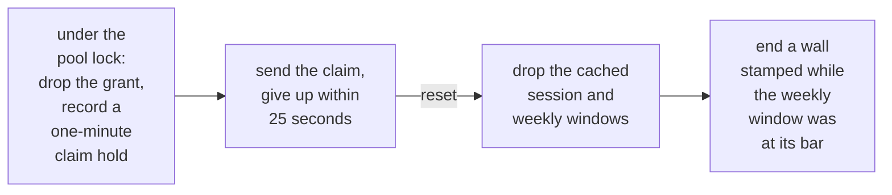
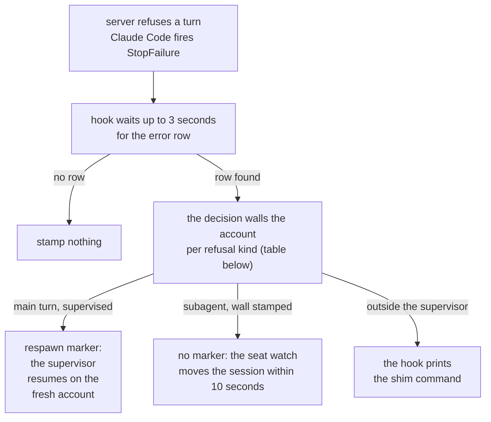
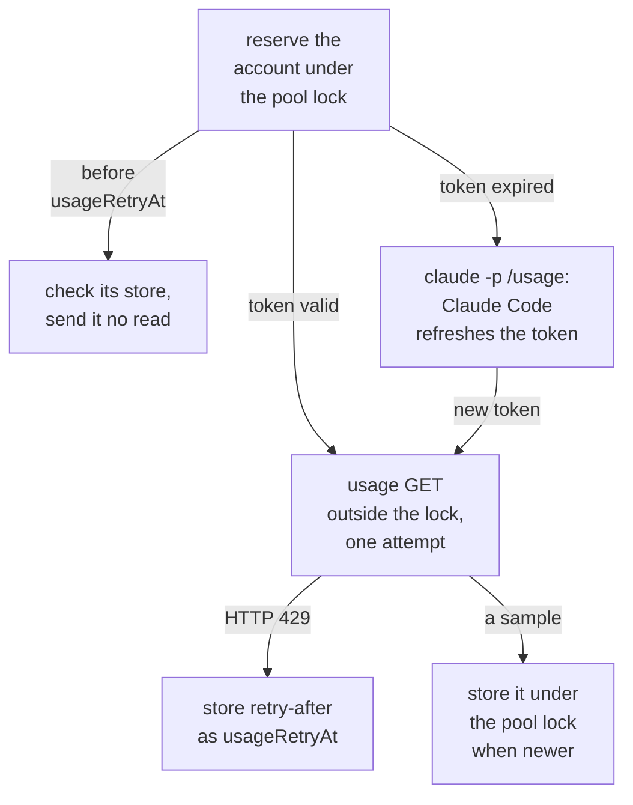

Every Claude session runs on its own seat: the account whose credential store the supervisor gave it at launch. The decision runs for that seat at every turn boundary (the Stop hook), on session start, and after a server refusal (the StopFailure hook). It has one rule:



- The same ranking places a new session at launch.
- A launch onto a depleted pool takes the same target selection, counting running sessions as well as queued waiters, and starts immediately.
- With no usable account, a stored API key with credit left comes before the wait, at launch and on a running session; see [API keys](#api-keys).
- Every Codex session runs on its own seat too: the account whose store the codex supervisor gave it at launch, decided the same way at each Stop hook; everything else is shared.

## The bars

| Bar | Default | Covers | Effective bar |
| --- | --- | --- | --- |
| `thresholds.session` | 90 | the 5-hour session window, in percent | `thresholds.session - projectionMargin` |
| `thresholds.weekly` | 98 | both the 7-day aggregate and every gated per-model weekly cap | `thresholds.weekly` |

- A 5-hour reset is cheap to sit out. Weekly quota is use-it-or-lose-it, so it drains close to the limit.
- `policy.projectionMargin` (default 0) is subtracted from the session bar only.
- Both bars sit below 100 because the headroom is the budget to reach a clean turn boundary before the account hits its real limit.
- The weekly bar takes no margin: one turn is too small a fraction of the week to overshoot it, and margin there would strand use-it-or-lose-it headroom.
- Codex reads the same two bars.

### One bar for the trigger and the screen

The same bars gate the trigger and screen the candidates:

- The decision engages when the seat's measured usage is at or over a bar.
- A candidate is usable when none of its cached windows (session, weekly aggregate, gated per-model caps, and any server-pinned enforcement) is at or over one.
- A screen laxer than the trigger would land moves on accounts the trigger immediately re-flags, so there is exactly one bar per window.
- Unmeasured usage never reads as safe: an account with no sample ranks last, and a seat with no tee, no record, and no probe result does not trigger.
- A seat flagged for reauthentication or walled by an enforced limit triggers regardless of its figures.

### Per-account bars

`thresholds.accounts` gives one account its own two thresholds, keyed by its label in any pool, such as `{"shared-seat": {"session": 75, "weekly": 75}}`. That account's bars are its own session threshold minus `policy.projectionMargin` and its own weekly threshold, so the example holds the account at 75 percent of its 5-hour window and 75 percent of its weekly windows, per-model caps included. A label that names no pooled account has no effect.

The account's bars replace the global ones everywhere a bar is read: the trigger, the candidate screen, the seat watch, the headroom key of the ranking, the sample interval, and the depleted wait. Within `policy.accountReleaseMs` of a window's reset (30 minutes for the session window and 5 hours for a weekly window by default), that window's bar is the higher of the account's bar and the global bar, because quota left at a reset is lost. A depleted wait counts from that release time when the account's usage is under the global bar.

### Accounts on usage credits

An entry with `"credits": true`, such as `{"credit-seat": {"session": 100, "weekly": 100, "credits": true}}`, marks an account that keeps answering past its plan's limits on purchased usage credits. No window of that account screens it out, so it stays usable past 100 percent of its windows. Its bars still order the candidates and still trigger a move:

- Ranking: while any of its windows is at or over its bar, the account ranks after every usable account that is under all of its bars, and a Codex `seat` borrow spreads over the accounts under their bars before it counts borrowers.
- Trigger: a session on it at or over a bar moves to a usable account that is under all of its bars and has not refused the session for usage credits, through the same hooks and seat watch that move a session off any account, and stays on credits when no such account exists.

A new session, a move, a borrow, or a running session therefore spends credits only when no account has plan headroom left, and a session on credits moves back to plan quota at its next check after another account's window resets.

- An early server-side reset drops a wall on such an account the same way it does on any account.
- A server refusal also moves a session off it: a Claude usage-credits refusal moves the session as described under [Enforced limits](#enforced-limits), and any other classified refusal walls the account as it walls every account.
- A Codex usage read reports whether the account still has credits (`credits.has_credits`); once a read reports none, the account's own bars apply again until a later read reports credits.
- Claude's no-spend usage read carries no credit status, so a Claude account is screened by its refusals alone.

### Removed settings

Older versions carried a session ladder, an engagement floor, organization affinity, incumbent hysteresis, and wall bars. Their config keys are gone: an array `thresholds.session` fails config loading with a zod message naming the field, and `hardThresholds`, `policy.greedySessionFloor`, and `policy.greedySwapMargin` are ignored by the loader.

## The ranking: headroom per session, then pace pressure

Claude launches and session moves choose among usable accounts by the keys below, in order. Codex ranks by pace pressure, then soonest weekly reset, then lowest weekly use.

| Key | Prefers | Claude | Codex |
| --- | --- | --- | --- |
| Headroom per session | greatest first | 1st | not used |
| Pace pressure | highest first | 2nd | 1st |
| Weekly reset | soonest first | 3rd | 2nd |
| Weekly usage | lowest first | 4th | 3rd |
| Live sessions | fewest first | 5th | not used |

- Claude ranks unknown usage last.
- Accounts with no cached figure tie on every other key, so the session count alone spreads launches and `seat` borrows across them.
- Codex excludes an account running in another codex session outright, because a codex session cannot share a login.
- Neither pool has a manual switch, because placement is per session at launch.

### Headroom per session

The first key is the remaining headroom to the session bar divided by the number of sessions after placement:

```
(session bar - session used) / (live sessions on the account + 1)
```

The session count comes from the presence files of running supervised sessions and of `seat` borrowers, and from the claims of sessions that are moving to the account or waiting for its reset. The `+ 1` is the session being placed. Two fresh accounts therefore alternate: the second launch lands on the account that has no session yet, and a third launch goes to whichever of the two has more headroom left per session.

With the default bars (an effective session bar of 90):

| Session used | Live sessions | Score |
| --- | --- | --- |
| 80 percent | 0 | (90 - 80) / (0 + 1) = 10 |
| 10 percent | 1 | (90 - 10) / (1 + 1) = 40 |

The busier but fresher account wins.

Selection and the presence write share one critical section, so concurrent launches see each other. A move records its target in `wait-queue.json` in the critical section that picks it, and the relaunch replaces that claim with the presence file in one critical section, so a burst of moves spreads the same way while the moved sessions compact.

### Pace pressure

**Pace pressure**, the tie-break, is remaining percent of the binding gated window (the gated per-model cap with the least headroom) divided by time until its reset. An account with no gated row falls back to the weekly aggregate, because an unmeasured cap must not look safe and an account that never ran the gated model must not rank below one near the cap. Organization membership is not a ranking input.

### Cached figures

Everything runs off cached windows stored as absolute UTC epochs, so a stale snapshot still resolves correctly:

- A weekly reset that has passed extrapolates forward in exact 7-day steps.
- Any window past its cached reset counts as freshly empty: never a reason to switch, never a reason to keep an account benched.

The ranking reads cached figures only; a candidate is never sampled before a move. Before ranking, the decision folds every account's statusline tee into `accounts.json` (Claude; Codex has no tee), so an account with live sessions is ranked on its sessions' latest push. Figures for accounts without sessions stay fresh through the [periodic check](#periodic-check).

The seat itself is sampled inside the decision when its tee is older than `policy.usagePollTtlMs` or its active model is a gated family, and its last sample attempt is older than the account's sample interval (see [Periodic check](#periodic-check)):

- The sample is one attempt with no retries, over the direct usage read.
- The interval doubles after each failed sample up to 30 minutes and resets on success.
- No sample runs when the hook is stamping an enforced limit or the seat is already walled.
- A sample that finds the stored access token expired has Claude Code refresh it first (see [Periodic check](#periodic-check)).
- A Codex seat reads its usage GET when its cached figure is older than the TTL.

### Unusable accounts and stores

- An account requiring reauthentication is excluded for the evaluation.
- A store whose credential Claude Code cleared after a failed refresh is marked for reauthentication and the next candidate is tried; a store with no credential or an unreadable one is skipped for the evaluation.

## Compaction before a move

A move that the bars trigger compacts the conversation on the account it is leaving before the session resumes on the next one. The old account still has headroom at the bar and holds the warm prompt cache, so the summary is cheap there. The first turn on the new account then carries the summary instead of the full transcript, which is otherwise re-uploaded uncached once per move.



| | Claude | Codex |
| --- | --- | --- |
| Runs in | the supervisor, after it stops the session at the turn boundary | the Stop hook, which reads the seat's usage, when the seat is at or over a bar |
| Call | `claude -p --resume <session-id> /compact` under the old account's store | `codex app-server` resumes the same thread on the session's account (`thread/resume`, then `thread/compact/start`), and the hook waits for the compaction turn to complete before the decision runs |
| Bound | 5 minutes | 3 minutes; the hook is declared with a 300-second timeout to cover the step |
| On failure | a compaction that fails (a session too short to compact, a refused request, a timeout) is logged, the supervisor prints why, and the session resumes with its full context | a compaction that fails is logged, and the move proceeds with the full history |
| Resume | `--resume` under the target's store with a first prompt that names the compaction (see [Architecture](/architecture)) | `codex resume <session-id>` on the new account continues from the compacted history in the thread's rollout |

For Claude:

- Claude Code writes the compaction boundary into the same transcript, and the relaunch honors it.
- The supervisor counts the compaction as landed only when that boundary appears, because `claude -p` exits 0 on a refused compaction too.
- A session with no transcript file on disk, or one launched with no seat, skips the step.
- The depleted-pool wait compacts the same way before its countdown.

A move the enforced-limit path triggers never compacts, and neither does any move while the old account carries an enforced-limit wall (a seat-watch move after a subagent's refusal, for one): the account already refused a request, so the compaction call would fail the same way.

## When nothing is usable

When every account is at or over a bar and no stored API key has credit left (see [API keys](#api-keys)), the decision assigns the session to a recovery account. If that reset lands within twice `policy.maxWaitMs` (`maxWaitMs` defaults to 1 hour), the supervised session pauses until it and resumes on that account (see [Architecture](/architecture)). Assignment is first come first served with at most eight waiting sessions per account, so one reset wakes at most eight sessions instead of the whole pool.



The wait target follows these steps in order:

| Step | Wait target |
| --- | --- |
| 1 | Waiters fill the soonest-resetting account first, then the next, and so on, while a reset within `policy.maxWaitMs` has fewer than eight waiters. |
| 2 | A session that arrives when every reset within `policy.maxWaitMs` already has eight waiters waits for the next reset with room, up to twice `policy.maxWaitMs` out, rather than piling onto the soonest. |
| 3 | Only when every reset within that horizon is full does it join the least-crowded one (ties broken by soonest reset, then the session's own account). |

- Claims live in `wait-queue.json` for the length of the countdown and are released when the session relaunches.
- When no account resets within twice `policy.maxWaitMs`, the decision reports the pool as depleted and the session stays put, keeps running into its real limit, and the enforced-limit path below takes over.
- The pause happens at the bar, not at 100: the unspent headroom is the same budget that set the bar.
- Only a supervised session waits: a session outside the supervisor gets the enforced stamp and nothing else.
- Codex has no pause; it rides its account until the server refuses it.

## API keys

Anthropic API keys stored with `tokenmaxxing key add` are a paid fallback for Claude sessions. A session runs on a key only when no pooled account is usable, and it leaves the key at the next turn boundary after one is, because a key costs money and a subscription does not.



- **When a key is used.** At launch, the supervisor picks a key when no account is usable, before the wait target and the earliest-reset fallback. On a running session, a decision that finds no usable account tries a key before it assigns a wait target.
- **Ranking.** A key is a candidate when no turn on it ended with `billing_error` and, when you entered a balance, its credit left (the balance minus the recorded spend) is above 0. Keys with the most credit left rank first. A key with no balance entered ranks after every key with one, because an unknown balance must never look safe. Ties go to the key with the fewest running sessions, then to the oldest key.
- **Stickiness.** A session stays on its key while the key has credit left and no subscription account is usable. It moves to another key only when its key is spent (credit left at or below 0) or refused.
- **Return to a subscription.** The Stop hook moves a key session to the account that ranks first once one is usable, at the turn boundary, and so does the SessionStart hook, which runs before any turn. The supervisor's seat watch never cuts a turn on a key to save money: it moves a key session only when the key is spent or refused, to an account when one is usable, else to the next key, else to the depleted wait. The seat watch on an account seat that crosses a bar mid-turn moves the session to a key the same way the hooks do, compacting first. An account that is usable only on usage credits (`credits` in `thresholds.accounts`) does not draw a session off a key.
- **Refusal.** When a turn on a key ends with `billing_error`, the StopFailure hook marks the key as refused and moves the session to the next key, or to the depleted wait when no key is left. Any other error on a key session moves nothing. `key credit` clears the refusal.
- **Spend.** The supervisor is the only writer of a key's spend. It reads the session's cumulative cost estimate from Claude Code (the statusline's `cost.total_cost_usd` in a terminal session, the `total_cost_usd` of each stream-json `result` line in a harness session) every seat-watch tick and once after the process exits (a `result` line with `num_turns` 0 and `total_cost_usd` 0, such as the one Claude Code writes when a reply stops while a tool call waits for permission, ran no turn and is not a reading), and it adds the growth since its last reading to the key. The last reading is kept per live session id in `api-keys.json`, in the same atomic write as the key's spend, so a failed write followed by a retry never bills twice. The cost a session ran up on a subscription account before it moved to the key is recorded as its starting point and never billed to the key. A session id with no recorded reading starts at 0 when the session began fresh (a new session or `/clear`) and starts at the total Claude Code restores from the conversation's transcript when the supervisor resumed it, so a resumed session's restored total is never billed and its first turn is. A conversation that an in-session `/resume` opens takes its restored total the first time the supervisor sees its cost, which can leave the turn that ran before that unbilled.
- **Refused accounts.** A key session never moves to an account that has already refused it with a usage-credits refusal (the accounts in `TOKENMAXXING_REFUSED`); it stays on the key instead.
- **Compaction.** A move off a key compacts on that key, the same way a move off an account compacts on the account. A key that is spent or refused gets no compaction.

## Banked resets

An account can hold a banked reset: a one-time reset of its usage windows that the provider grants, such as a promotional reset. When an account's weekly window is at or over its weekly bar and its weekly reset is more than three days away, tokenmaxxing spends the account's banked reset on it, so the account does not sit out the rest of the week. When the weekly reset is three days away or less, or its time is unknown, the account waits for it and keeps the banked reset.



### The claim per provider

- Claude: the direct usage read carries the account's reset grants in its `cedar_ember` block, the block Claude Code's own limit-reset offer reads. A grant counts when it is the account's next grant, the server marks it usable now, it is not paused, it has a reset left, and it clears the weekly window. The claim is the call Claude Code makes, `POST /api/organizations/<organization>/reset_rate_limits` with that grant, under the account's stored access token. The usage read sends Claude Code's `User-Agent`, `claude-cli/<version> (external, cli)` with the version that the real binary's `--version` prints, because the server reports no grant to any other client.
- Codex: the usage read carries `rate_limit_reset_credits.available_count`, and the claim is the call `codex` makes, `POST https://chatgpt.com/backend-api/wham/rate-limit-reset-credits/consume`, under the account's stored access token. A token that is about to expire is never refreshed for a claim.

### When the claim runs

The claim runs at the start of every decision that carries no server refusal (the Stop hook, the supervisor's seat watch, and the Codex Stop hook) and on every check tick for both pools. It runs for every account in the pool that qualifies on its cached figures after its newer statusline tee is folded in. The decision after a server refusal (the StopFailure hook) claims nothing: the refused session moves as described under [Enforced limits](#enforced-limits), and the next decision or tick claims the reset, which ends the wall that the refusal stamped. Each claim and its answer is logged as `decide.banked_reset`.

### One claim per grant

Under the pool lock, the account record drops the grant and records a one-minute claim hold before the claim is sent. The claim gives up within 25 seconds. A usage read sent before the hold ends cannot bring the grant back, so concurrent decisions and reads in flight send one claim per grant. Only a usage read sent after the hold that still reports a usable grant brings it back.



### After a reset

When the server answers `reset`, the account record drops its cached session and weekly windows, so the account is unmeasured until its next sample, and an enforced-limit wall stamped while the weekly window was at its bar ends. A session whose own seat takes the reset at a turn boundary stays on that seat.

The seat watch reads the seat's statusline tee. A terminal statusline that renders between the claim and the next model response writes the figures from before the claim with a fresh time, and the seat watch then moves the session once. The account keeps its reset.

## Per-model caps

`policy.switchModels` (default `["fable"]`) names the model families whose per-model weekly cap can trigger a move. Matching is by family token, never by exact display string: model display names drift ("Fable" became "Fable 5"), and an exact-string gate once silently disabled per-model switching entirely.

### The session's model

A session's model is the `--model` value it was launched with. The supervisor reads it from the launch flags (a bare `claude --resume <session-id>` replays the flags the session was first launched with) and hands it to the session's hooks in `TOKENMAXXING_MODEL`. A session gates only the configured family that its launch model names. With the default `["fable"]`:

| Case | What gates |
| --- | --- |
| Launched as Fable | the Fable cap |
| Launched as Opus, Sonnet, or Haiku | no per-model cap: launch placement, the seat watch, the trigger, and candidate screening read only the session and weekly windows for it, so it runs on an account whose Fable cap is spent while that account's session and weekly windows have headroom |
| A value that names no model family (`best`, `opusplan`), or a launch without `--model` | unknown: launch placement and the seat watch gate every configured family for such a session, and its hooks fall back to the model in the account's statusline tee |
| A move off a seat that carries an enforced-limit wall, or a move that follows a subagent's five-hour or weekly refusal | candidates are still screened on every configured family (see [Enforced limits](#enforced-limits)) |

A model changed inside the session with `/model` does not change the launch value, and the enforced-limit path below catches a Fable refusal in a session launched on another model.

### Related safety rules

- An unknown active model gates every configured family. A launch without `--model` has no model yet, and right after a respawn such a session runs model-blind until its first statusline render on the new account; treating unknown as unconstrained once let an account sit at its Fable cap for hours unnoticed.
- Candidate screening counts gated per-model caps too, so a pool where every account has burnt its Fable cap does not round-robin.
- Codex has no model in its usage feed, so every named Codex limit window screens and triggers against its own bar (session or weekly by duration); `policy.switchModels` gates Claude per-model rows only.
- The usage-credits refusal of the enforced-limit path (below) is not gated by `policy.switchModels`: it moves the session whatever that list holds, and it writes no wall.

## Enforced limits

The cached figures can lag reality: a seat's per-model cap is not in the tee and comes only from the seat's own sample, at most once per sample interval, which shrinks to `policy.usagePollTtlMs` as the cap nears the weekly bar. When the server actually refuses a turn, Claude Code ends it on an API error and fires its `StopFailure` hook instead of `Stop`. tokenmaxxing installs that hook with a `rate_limit|oauth_org_not_allowed|billing_error` matcher, and it reads the transcript's structured error row (the same row Claude Code marks `isApiErrorMessage`). `billing_error` acts only on a session that runs on an API key (see [API keys](#api-keys)); on an account it changes nothing. A host installed before the matcher named `billing_error` gets it when `init` runs again, and `doctor` reports the stale matcher until then.



### Refusal kinds

| Refusal | How the error row shows it | Wall (`enforcedUntil`) |
| --- | --- | --- |
| Session or weekly window | a `quotaLimits` block names `five_hour` or `seven_day` with the server's reset | until the reset |
| Per-model cap (`kind: model`) | a `quotaLimits` block names a per-model type with the server's reset | until the reset, unless the cached family window already screens it (see below) |
| Overage | a `quotaLimits` block names `overage`, the usage credit limit of an account already past its plan's limits | until its plan answers again: the cached weekly reset when the cached weekly window is at 100 percent, else the cached session reset (or five hours) |
| Usage credits | no `quotaLimits`; the row's typed `apiError: "model_requires_usage_credits"` (the Fable allowance used up, usage credits off or spent, or a monthly spend limit reached) | none (see [Usage-credits refusals](#usage-credits-refusals)) |
| Organization | the row whose `error` is `oauth_org_not_allowed` (the account's organization disabled Claude subscription access for Claude Code) | five hours (see [Organization refusals](#organization-refusals)) |

Model prose is never read.

### How the wall is written

The hook hands the classified refusal to the decision, which blocks the seat until the reset inside the same critical section that picks the target. It writes `enforcedUntil` on the account record, using the first of these that exists:

1. the server's reset, when the row carries one;
2. the account's own cached reset for that window;
3. now plus the window length.

A later wall already on the account is never shortened.

A `kind: model` refusal (a per-model cap named in `quotaLimits`) does not write that field when the cached family window already sits at or over its bar and stays there until its reset. The window then screens per family, so a session that does not gate Fable can still use the account. An account's `thresholds.accounts` entry can release the window to the global bar before then, and the wall lands in that case. The wall still lands when that cached row is missing or under the bar, or when a wall is already active.

That one field is what the trigger and the candidate screen read, so:

- an account with no usage sample yet cannot be picked straight back;
- a model-kind wall that did land parks the account until its weekly reset;
- a seat still walled after a failed move keeps triggering on every later boundary, screening candidates on every configured family because the wall does not record which one tripped.

The decision treats the enforcement as a fact stronger than any cached window (it skips the probe, gates candidates by the tripped family, and never holds the seat) and moves away.

### When a wall ends early

A wall of any kind ends early when fresh figures for the account (a direct usage read or a statusline tee) show its 5-hour and weekly windows under their bars while the stored figures had one of them at or over its bar before that window's reset. That drop means the server reset the window ahead of schedule, such as after a manual reset, so the account is usable again.

The wall does not record which refusal stamped it, so the rule reads only those two windows:

- A wall stamped while neither was at its bar, such as a per-model refusal on an account with 5-hour and weekly headroom, holds until its deadline.
- A wall stamped while one of them was at its bar ends at that window's early reset, whatever refusal stamped it.

### Which families a refusal screens

- A subagent's five-hour or weekly failure screens every configured family, because the tee reports the main session's model and not the subagent's.
- So does a failure that lands while an earlier wall is still active, whichever deadline is later, because that wall does not record which family tripped.
- The stamp and the selection share one lock, so two hooks that fail back to back cannot lose that screening.

### Which row the hook reads

- The seat is fixed for the life of the process (a respawn is a new process under another store), so a failure is always attributed to the account the session actually ran on; there is no adoption window and no cooldown.
- The hook reads the newest error row whose `error` equals the hook's and whose text equals the refusal text on the hook's input (`last_assistant_message`), so an earlier refusal with other text in the same transcript, such as the one that moved the session to this account, is never read as this one.
- For a subagent's failure the hook reads the subagent's own transcript, `agent-<agent-id>.jsonl` anywhere under the `<session-id>/subagents/` directory beside the session transcript, because Claude Code writes a subagent's rows there while the hook input names only the session transcript.
- The hook waits up to three seconds for that row, because Claude Code can fire the hook before the row is flushed to the transcript; a failure with no row stamps nothing.

### After the stamp

- In a supervised session whose main turn failed, the hook also drops the respawn marker: the supervisor relaunches `--resume` on the fresh account and submits its resume prompt, so the conversation continues there on its own.
- A failure inside a subagent stamps the wall, unless it is a model-cap refusal the cached family window already screens, and returns without a marker; the supervisor's seat watch reads the wall within ten seconds and moves the session (see [Architecture](/architecture)).
- A session outside the supervisor has nothing to move: the stamp still lands when the inherited store variable names a seat, and the hook prints the shim command (`~/.config/tokenmaxxing/bin/claude --resume <session-id>`) as a system message, so the refusal always names the way out.

### Usage-credits refusals

A usage-credits refusal writes no wall. The usage read shows no sign of it: the refusing account's Fable row can read far under its bar while another account serves the same session. The decision therefore moves the refused session and blocks no account: it screens candidates by their Fable windows and skips every account that has already refused this session.

- The supervisor keeps that list for the life of the session and hands it to each new process, and every later credits move skips those accounts, so these moves try each account at most once.
- A move off an account with `"credits": true` that still answers skips them too, so a session that a plan account refused stays on credits instead of returning to that account.
- A move for a bar or a wall does not read the list, because a `/model` change inside the session can make those accounts usable again; such a move can land on a refusing account, and the next refusal moves the session on.
- Once every candidate has refused, the session stays where it is and the refusal text tells you to switch models.
- A credits refusal inside a subagent moves nothing.
- An account that accepts the session may be spending usage credits on Fable; the usage read cannot show that either.

### Organization refusals

An organization refusal walls the account for five hours, because the row names no window and no reset, and the usage read cannot show when the organization restores access.

- The wall keeps launches, resumes, and moves off the account.
- The refused session moves the way it does after a five-hour refusal, and the seat watch moves every other session on the account within ten seconds.
- After the wall ends the account is a candidate again; when its organization still refuses it, the first refused turn walls it again and moves that session.

## Periodic check

The timer runs `tokenmaxxing check` once per tick (`policy.checkIntervalMs`, 60 seconds by default). A tick runs from no session, so it has no seat to move. launchd and systemd both skip a firing while the previous check is still running, so ticks never overlap. Each tick:

- folds every fresh tee into `accounts.json`;
- spends the banked resets that are due (see [Banked resets](#banked-resets));
- samples up to three accounts: accounts with a live session first, then the ones whose last sample attempt (`lastUsageAt` or `lastProbeAt`) is oldest, skipping any attempted within the account's sample interval;
- deletes atomic-write temp files older than an hour (see [Temp file sweep](#temp-file-sweep)) and prunes session flag files older than 30 days;
- on a Bun global install, ends by checking npm for a newer version, at most once a day (see [Automatic updates](/distribution#automatic-updates)).

With `n` pooled accounts every account is attempted about once per `n/3` ticks, or once per its sample interval plus a tick when that is longer, so a figure is as fresh as its last successful attempt and an account whose samples keep failing stays as stale as the decision last saw it (see [Honest limitations](/limitations)).



### Sample interval

The usage endpoint rate limits each account on its own, so the interval follows the cached figures. The window closest to its bar sets it, as 15 minutes times the fraction of that bar still unused, never under `policy.usagePollTtlMs`, so a value above 15 minutes sets every interval. The per-model caps of the `policy.switchModels` families count, except one already at the weekly bar, which screens only that model's sessions.

The first three rows hold with the default value of `policy.usagePollTtlMs`:

| Account | Interval |
| --- | --- |
| Empty | 15 minutes |
| At half its session bar | about 7.5 minutes |
| Within a tenth of a bar | `policy.usagePollTtlMs` |
| Session or weekly aggregate at or over its bar | 15 minutes |
| No stored figure | `policy.usagePollTtlMs` |
| No session or borrower on this host | 15 minutes |

- An account at or over its bar waits 15 minutes because only a reset changes it: a passed scheduled reset already reads as 0, and an early server-side reset shows at the next sample, up to 15 minutes later.
- An account with no session or borrower on this host waits 15 minutes because only a reset or another host moves it.
- `status` and the seat's sample inside a hook decision wait out the same interval.
- Every sampler claims the read under the pool lock before it sends it, so concurrent hooks and `status` runs send an account one read.
- A seat's figure is the one that moves and the supervisor's seat watch reads it, so a live seat is attempted about once per interval plus a tick, and not at all while its sessions' tee is fresh unless it carries a gated per-model cap, which only a read refreshes.

### The usage read

Each account is read first with the direct `GET /api/oauth/usage?at_wall=1&skip_spend=1` and its stored access token. It is the no-spend read Claude Code itself uses (`skip_spend=1`), so it opens no window, spends nothing, and starts no `claude` process, and it answers for a seat with live sessions as well as for an idle account.

The body carries the session and weekly windows (`five_hour` and `seven_day`, a percent and an ISO reset time) and the per-model caps (`limits[]` rows of kind `weekly_scoped`, named by the model's display name), so a direct read is a complete sample.

- The tick holds the pool lock only to reserve the target and to store the result; the usage GET runs outside it, so an enforced-limit move never waits on a slow sample.
- The read gets one attempt, because the round-robin is its retry loop.
- A result is stored only when it is newer than the sample already on record.

### Expired access tokens

No sampler sends a read with an expired stored access token: the endpoint answers such a read with HTTP 401 and, after a few of them, with the hour-long 429 (see [Failures and rate limits](#failures-and-rate-limits)). tokenmaxxing holds no refresh grant, so a sample that finds the token expired first runs `claude -p /usage --no-session-persistence --safe-mode` with the account's store set and a throwaway `CLAUDE_CONFIG_DIR`. Claude Code refreshes the token under its own refresh lock, and the sample reads with the new token.

- That child makes no model call and opens no session window, and its output is not read.
- It runs only for an expired token, so an idle account starts one about once per access-token lifetime (8 hours in the observed case).
- A refresh that leaves the token expired fails the sample with its exit code, and a store the refresh clears is flagged for reauthentication.

### Failures and rate limits

| Failure | Effect |
| --- | --- |
| A failed read | The account has no figure for that attempt, and its cached figure stays as stale as it was. |
| HTTP 429 with a `retry-after` time (about an hour in the observed case); a read sent during that penalty fails too | The tick stores the time as `usageRetryAt`. Until it passes, the account keeps its turn in the round-robin, where the tick still checks its store and sends it no read, and `status` and the seat's in-decision sample skip the read for the same account over the same period. The cached figure stays as stale as it was for that long. |
| A store that cannot be read at all (missing or unreadable credential) | A permanent condition until you re-authenticate it. After five consecutive store failures the tick stamps `needsReauth`, which drops the account out of sampling and candidacy and surfaces it in `status` and `auth --all`. A successful store read resets the counter. |

A failed attempt counts as an attempt, so a broken account moves to the back of the line instead of blocking the others.

### Temp file sweep

The tick also deletes atomic-write temp files older than an hour in these places:

- the state root;
- every other directory under it that tokenmaxxing writes an atomic target into: `usage/`, `live/`, `respawn/`, `sessions/`, `bin/`, `codex-live/`, `codex-respawn/`, and `codex-onboard/`;
- each per-account store, where an onboarding killed between the write and the rename would otherwise strand a 0600 file holding a full credential.

Each place is swept under these rules:

- Every one of those is a flat read of the directory, never a walk.
- Each one is resolved before it is read and skipped unless it resolves inside the resolved state directory, and only regular files are removed, so the sweep cannot delete anything outside the state directory however the paths are linked; a symlinked state directory still sweeps its own contents.
- The symlinks a Codex store points at `~/.codex` with are left alone.
- A directory that cannot be read is logged and skipped rather than failing the tick.
